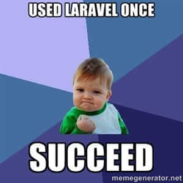

Bugün sizlere popüler PHP Framework’ü [Laravel 4](http://www.laravel.com) üzerinde popüler authentication sınıfı [Sentry](https://cartalyst.com/manual/sentry/introduction) (v2) ile Facebook connect entegrasyonunu nasıl yapacağınızı anlatacağım. Normalde Sentry için Cartalyst’in [Sentry Social](https://cartalyst.com/manual/sentry-social) adında bir paketi var ve çoğu oAuth ve oAuth2 bileşenlerini otomatik olarak destekliyor, fakat bu paket ücretli (ayda 20 dolarlık bir paketin parçası).

Ben de bunun yerine _“neden kendimiz yapmayalım ki :)”_ mottosuyla hem Facebook PHP-SDK API’sini kurcalayarak, hem de hibrit bir yolla kendimce bir authentication oluşturdum.


#### Bu aşamaları takip ederseniz;

* Sentry 2 kullanan uygulamanıza Facebook kullanıcıları **kayıt olabilir**,
* Bu uygulamanıza Facebook kullanıcıları **giriş yapabilir**,
* Facebook üzerinden siteye kayıt ve giriş yapan **kullanıcılar** isterlerse Facebook girişi değil, kayıt sırasında atanan **normal kullanıcı adı ve şifreleri ile de giriş yapabilir** olacaklar.

### Gelelim Yapılacaklara;

* İlk önce henüz oluşturmadıysanız [Facebook Developers](https://developers.facebook.com/apps) sayfasından bir facebook uygulaması oluşturun. Deneme amaçlı sandbox modu açık olarak bırakırsanız şimdilik daha kolay test edebilirsiniz. Uygulamanın App ID ve Secret keylerini not alın.
* Şimdi Sentry’i Laravel Projenizde kurduğunuzdan [emin olun](https://cartalyst.com/manual/sentry/installation/laravel-4).
* Ardından [Facebook PHP-SDK](https://github.com/facebook/facebook-php-sdk)’yı projenize dahil etmelisiniz. Bunun için `composer.json` dosyasında `require` kısmı içine `"facebook/php-sdk": "dev-master"` değerini ekleyin (_virgüllere dikkat! Son değer hariç tümünde virgül ile ayrık olmalı değerler_). Alternatif olarak `composer require facebook/php-sdk` diyerek de ekleyebilirsiniz.
* Şimdi de `composer update` ya da `php composer.phar update` komutu ile değişiklikleri alıp paketi projenize ekleyin.
* Daha sonra facebook metalarını tutacak yeni bir tablo oluşturalım. Bunun için bir migration dosyası oluşturmalıyız:

```php
<?php
/**
* @author Arda Kılıçdağı
* @web arda.pw
*/
use Illuminate\Database\Migrations\Migration;
use Illuminate\Database\Schema\Blueprint;

class CreateUserFbMetaTable extends Migration {

  /**
   * Run the migrations.
   *
   * @return void
   */
  public function up()
  {
    Schema::create('user_fb_meta', function(Blueprint $table) {
      
      $table->increments('id');
      $table->bigInteger('fbID')->unsigned()->default(0);
      $table->integer('userID')->unsigned()->default(0);

      $table->string('first_name',400)->default('');
      $table->string('last_name',400)->default('');
      $table->string('link',400)->default(''); //facebook adres linki
      $table->string('location_id',400)->default(''); //location[id]
      $table->string('location_name',400)->default(''); //location[name]
      $table->string('gender',100)->default(''); //male/female/?????
      $table->string('email',400)->default(''); //email adresi
      $table->string('timezone',100)->default(''); //timezone
      $table->string('locale',100)->default(''); //en_US gibi, tr_TR gibi
      $table->enum('verified',array('0','1'))->default('1'); //boolean geliyor, true 1, false 0 olur
      $table->string('updated_time',100)->default(''); // 2014-01-14T09:05:55+0000 , son profil güncelleme sanırm
      $table->string('username',100)->default(''); //facebook.com/{kullanici_adi} gibi.

      $table->longText('rawData')->default(''); //raw data jsona çevrilmiş


      $table->index('fbID');
      $table->index('email');
      $table->foreign('userID')->references('id')->on('users')->onDelete('cascade');

      $table->timestamps();
    });
  }


  /**
   * Reverse the migrations.
   *
   * @return void
   */
  public function down()
  {
    Schema::drop('user_fb_meta');
  }

}
```

* Şimdi de bu migrationı migre edip facebook meta tablosunu oluşturuyoruz: `php artisan migrate`
* Ardından `User` modelimizi açıp relation tanımlamamız lazım:

```php
<?php
/**
* @author Arda Kılıçdağı
* @web arda.pw
*/
//User.php Modelinize eklenecek relation
public function fb() {
  $this->hasOne('Userfb', 'userID');
}
```

* Şimdi facebook için bir konfigürasyon dosyası oluşturmalısınız. Ben bunun için aşağıdaki dosyayı `app/config/facebook.php` olarak kaydettim (içindeki `appId` ve `secret` kısımlarını ilk maddede not aldığımız kendi uygulamanızınkilerle doldurmayı unutmayın):

```php
<?php
/**
* @author Arda Kılıçdağı
* @web arda.pw
*/
return array(
  'appId' => '',
  'secret' => ''
);
```

* Şimdi de bir önceki adımda tanımladığım relationu oluşturmak için `Userfb` diye bir model oluşturdum ve relationları tanıladım: `app/models` klasörüne (ya da artık nerede tutuyorsanız modelleri) oraya `Userfb.php` olarak aşağıdaki kodu ekleyin:

```php
<?php
/**
* @author Arda Kılıçdağı
* @web arda.pw
*/
class Userfb extends Eloquent {

  protected $table = 'user_fb_meta';

  protected $fillable = array(
    'fbID', 'userID',
    'first_name', 'last_name',
    'link', 'location_id', 'location_name',
    'gender', 'email', 'timezone', 'locale',
    'verified', 'updated_time',
    'username',
    'rawData',
  );

  public function user() {
    return $this->belongsTo('User', 'userID');
  }

}
```

* Şimdi de route tanımlamamız lazım. Facebook için ben 4 tane route tanımladım. İkisi giriş kayıt butonlarına tıklanınca olan actionlar, diğer ikisi de Facebook’ın bu istek üzerine giriş vs. yapıldıktan sonra datayı doğrulama yapmamız için geri döndürdüğü callback route’ları olacak. Ben şu şekilde örnekledim:

```php
<?php
/**
* @author Arda Kılıçdağı
* @web arda.pw
*/

//app/routes.php içinde rotalar.
Route::get('facebook/login', array('as' => 'facebook_login', 'uses' => 'FacebookController@getLogin'));
//Callback'leri GET metodu ile veriyor Facebook
Route::get('facebook/login/callback', array('as' => 'facebook_login_callback', 'uses' => 'FacebookController@getLoginCallback'));

Route::get('facebook/kayit', array('as' => 'facebook_kayit', 'uses' => 'FacebookController@getKayit'));
Route::get('facebook/kayit/callback', array('as' => 'facebook_kayit_callback', 'uses' => 'FacebookController@getKayitCallback'));
```

* Şimdi de bu route’ları barındıracak controllerımız lazım. Örnekte `FacebookController` diye gittim, öyle vereceğim. Aşağıdaki dosyayı `app/controllers` klasörü altına (veya controllerları nerede barındırıyorsanız) `FacebookController.php` olarak ekleyin:

```php

<?php
/**
* @file FacebookController.php
* @author Arda Kılıçdağı
* @web arda.pw
*/

class FacebookController extends BaseController {

  //login siteden login butonuna tıklanınca olacak olay. 
  public function getLogin() {

    $facebook = new Facebook(Config::get('facebook'));
    $params = array(
      'redirect_uri'  => URL::route('facebook_login_callback'), //getLoginCallback() aslında
      'scope'     => 'email',
      'display'     => 'popup', //popup tipinde açıyorum ben kodumda
    );
    return Redirect::to($facebook->getLoginUrl($params));

  }

  //Login metodu facebookdan dönen callback
  public function getFacebookLoginCallback() {

    $code = Input::get('code');
    if (!isset($code) || strlen($code) == 0) { //kod doğru gelmiş mi?
      return 'Facebook\'a erişimde bir sorun oluştu, lütfen yeniden deneyin.';
    }

    $facebook = new Facebook(Config::get('facebook'));

    $uid = $facebook->getUser(); //user'ı yakalayalım

    if ($uid == 0) { //facebook'dan veriyi almada sorun yaşadık mı?
      return 'Facebook\'tan gelen verilerde geçerli bir kullanıcı bulunamadaı, lütfen yeniden deneyin';
    }

    $me = $facebook->api('/me'); //kendimizi yakalayalım.

    //önce user var mı o faceboook id sinde tablomuzda ona bakalım
    $fbuser = Userfb::where('fbID', $me['id'])->first(); //Facebook metasında bu user var mı? Varsa çekmeye çalış (daha önceden kayıtlı mı?)

    //şimdi fbuserdan user yakalayalım
    $user = User::find($fbuser->userID);

    //var mı?
    if($fbuser && $user) { //hem facebook metasında, hem de düz users tablosunda yakaladık kullanıcıyı, login etmeye devam edebiliriz.

      $email = $user->email;
      //şimdi bi nedenden metadatası kalmış ama user silinmiş olabilir, onu da bi kontrol edelim.
      //Normal durumda else'e hiç düşmemeli
      if($email) {

        //Sentry tipi üyeyi bulalım ve exceptionları catch edelim. 
        //Çünkü bu kullanıcı önceden banlanmış bir üye de olabilir sonuçta.
        try {
          $user = Sentry::findUserByLogin($email);

          //Şimdi Sentry'den login edelim, 2. parametre true
          Sentry::login($user, true);
        } catch (Cartalyst\Sentry\Users\UserNotActivatedException $e) {
          return 'Kullanıcı aktifleştirilmemiş!';
        } catch (Cartalyst\Sentry\Users\UserNotFoundException $e) {
          return 'Kullanıcı bulunamadı';
        } catch (Cartalyst\Sentry\Throttling\UserSuspendedException $e) {
          return 'Kullanıcı geçici olarak engellenmiş, bir süre beklemeniz gerekmekte.';
        } catch (Cartalyst\Sentry\Throttling\UserBannedException $e){
          return 'Kullanıcı engellenmiş';
        }
        

        return 'Başarı ile giriş yaptınız';

      } else {
        return 'Bir sorun oluştu, lütfen yeniden deneyin.';
      }
    } else {

      return 'Sitede Facebook ile eşleşmiş bir hesabınız bulunamadı, Eğer henüz hesabınızı profilinize bağlamadıysanız sitemize normal giriş yapıp profil düzenle sayfanızdan hesabınızı bağlayabilirsiniz.';

    }

  }

  //kayıt butonuna basınca olacak olay
  public function getKayit() {
    $facebook = new Facebook(Config::get('facebook'));
    $params = array(
      'redirect_uri'  => URL::route('facebook_kayit_callback'), //getKayitCallback() aslında
      'scope'     => 'email',
      'display'     => 'popup',
    );
    return Redirect::to($facebook->getLoginUrl($params));
  }

  //Kayıt formu callback
  public function getKaydolFacebookCallback() {
    $code = Input::get('code');
    if (!isset($code) || strlen($code) == 0) {
      return 'Facebook ile bağlanmada bir sorun oluştu, lütfen yeniden deneyin.';
    }

    $facebook = new Facebook(Config::get('facebook'));
    $uid = $facebook->getUser();

    if ($uid == 0) {
      return 'Facebook ile bağlanmada kullanıcı bilgileriniz alınamadı. Lütfen facebook\'a giriş yaptığınızdan emin olup yeniden deneyin';
    }

    $me = $facebook->api('/me');


    //Şimdi ilk olarak bu user daha önceden siteye facebookla kayıt olmuş mu ona bakalım:
    $currentFB = Userfb::where('fbID', $me['id'])->first();

    //eğer o id de facebook kullanıcısı varsa
    if($currentFB) {
      return 'Bu hesapla zaten Facebook\'a kayıtlı bir kullanıcı var. Lütfen hesabınızla giriş yapın.';
    } else {

      //şimdi bu kişi, kullandığı facebook emaili ile siteye facebooksuz kaydolmuş mu bir de ona bakmalıyız:
      $userWithEmail = User::where('email', $me['email'])->first();

      //eğer facebook emaili ile sitede kaydolmuş biri varsa
      if($userWithEmail) {

        return 'Facebook\'tan gelen email adresi ile sitemize kayıtlı bir kullanıcı zaten var. Lütfen hesabınızla giriş yapın, profil düzenleden hesabınızı facebook\'a bağlayabilirsiniz'; //arda.pw ev ödevi #1 olsun bu da size :)

      //ne facebook id si ne facebook emaili ile sitede kaydolmuş biri yok, kayıt edebilirsiniz
      } else {


        //Siteye normal giriş de yapabilir, onun için de bir parolası olsun
        $parola = Str::random(8);

        //Facebook'tan kullanıcı Resmini çekelim:
        $resimJSON    = file_get_contents('https://graph.facebook.com/'.$me['id'].'/picture?width=2000&redirect=false');
        $resimJSONArray = json_decode($resimJSON, true);
        $resimAdi     = parse_url($resimJSONArray['data']['url']);
        $resimAdi     = explode('/', $resimAdi['path']);
        $resimAdi     = last($resimAdi);
        $resimData    = file_get_contents($resimJSONArray['data']['url']);
        //resmi ftp ye atalım şimdi
        file_put_contents(Config::get('arda.profiles_folder').$resimAdi, $resimData); //KLASÖR AYARINI KENDİNİZCE DEĞİŞTİRMEYİ UNUTMAYIN!
        //facebook resim fasilitesi son

        //önce kullanıcıyı oluşturalım:
        //Not: Gelen Verileri kendinizce bir string temizleme metodu ile filtrelemenizi öneririm burada
        $user = Sentry::getUserProvider()->create(array(
          'email'     => $me['email'],
          'password'  => $parola,
          'first_name'  => $me['first_name'],
          'last_name'   => $me['last_name'],
          'activated'   => 1,
          'cinsiyet'  => $me['gender']=='female'?'bayan':'bay',
          'image'     => $resimAdi,
        ));

        //şimdi de facebook metasını oluşturalım:
        Userfb::create(array(
          'fbID'      => $me['id'],
          'userID'    => $user->id,
          'first_name'  => $me['first_name'],
          'last_name'   => $me['last_name'],
          'link'      => $me['link'],
          'location_id'   => $me['location']['id'],
          'location_name' => $me['location']['name'],
          'gender'    => $me['gender'],
          'email'     => $me['email'],
          'timezone'    => $me['timezone'],
          'locale'    => $me['locale'],
          'verified'    => $me['verified']?1:0,
          'updated_time'  => $me['updated_time'],
          'username'    => $me['username'],
          'rawData'     => json_encode($me) //tutuyorum ne varsa ne olur ne olmaz
        ));

        //şimdi login edelim
        Sentry::login($user,false); //exceptiona düşmemeli ondan direkt yazdım, 2. parametre beni hatırla, true ise beni hatırlaya basmış gibi.

        //TODO mail yollanabilir burada. Hoş geldiniz maili gibi.

        //şimdi geri döndürelim
        return 'Sitemize başarı ile kaydoldunuz!</p><p>Sitemize artık ister Facebook ile, isterseniz de parola girerek giriş yapabilirsiniz.</p><p>Sitemize Giriş için Facebook\'a ek olarak aşağıdaki bilgileri de kullanabilirsiniz:</p><p>E-posta: '.$user->email.'</p><p>Parola: '.$parola.'</p>';

      }
    }
  }
}
```

* Controller PHP dosyası içinde her şeyi satır satır açıklamaya çalıştım, umarım açıklayıcı olmuştur. (Verileri eklerken Eklenen verilerin null dönüp dönmediğini kontrol etmeyi unutmayın, ben bunun için bir fonksiyondan geçiriyorum tüm verileri, ya da migrationu geri alıp `default()` ları kaldırıp `null` değer eklenebilir şekilde ayarlayın)
* Şimdi de son yapacağınız şey sandbox hesabınızı açıp rotalar üzerinden deneme yapmak :)



* Eğer sorularınız olursa aşağıdaki yorum kısmından sorabilirsiniz. Elimden geldiğince cevaplamaya çalışacağım.

### İyi kodlamalar, afiyet olsun ;)