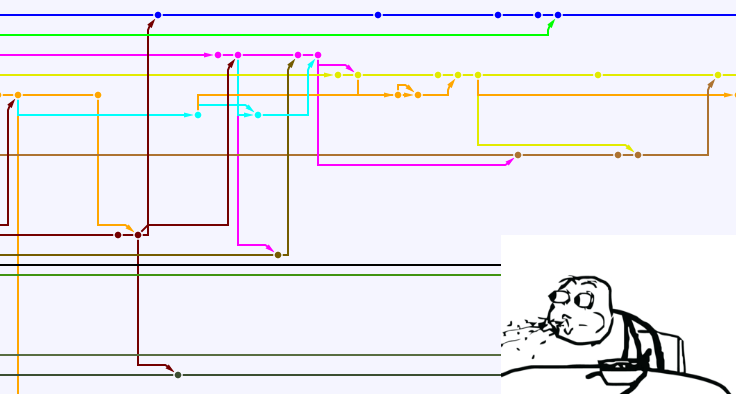

Merhaba arkadaşlar,

Bugün, sabahtan beri kafama takılan bir konu hakkında bu yazıyı yazmak istedim.

Bu yazımda git repolarınızdaki eski commit’leri birleştirmeyi (merge, squash) anlatacağım.

### Neden?

Çok basit örnek verecek olursak, [Arvim](https://github.com/Ardakilic/arvim) adında bir Vim konfigürasyonum var. Bu konfigürasyonu halen aktif olarak geliştiriyorum, ve de içinde belki de commit demeye değmeyecek kadar çok fazla ufak commit’ler vardı. Bu commitler history’i şişirmekle birlikte çok fazla gereksiz kalabalık yapıyordu. Bu nedenle derlilik amacı ile bazı commitleri, hatta tüm commit’leri tek commit’te birleştirmek ve de commit sayısını düşürmek istedim.

Ayrıca, yanlışlıkla pushladığınız api key gibi verileri git tarihinde komple yok etmek için ekleme ve silme commitlerini bu yolla bir sonraki commitle birleştirebilirsiniz.

**_Bu, büyük projelerde artık gerçekten gerekmiyorsa şunun gibi bir git history’den de sizi kurtaracaktır:_**



### Nasıl?

Öncelikle `git` sürümünüzü kontrol edin: `git --version`. `git 1.7.2` veya üstü bir sürümde olduğunuzdan emin olun, ardından çok basit aşamalar ile bunu gerçekleştirebilirsiniz:

* Öncelikle reponuzu lokalinize indirin:
* `git clone gitAdresiniz --recursive`
* Eğer zaten inikse güncel olduğundan emin olun:
* `git pull`
* Ardından tüm commitleri listeleyerek _rebase_ edeceğiz:
* `git rebase --root -i`
* Bu size vim, nano emacs vb. bir editör’de tüm commitleri listeleyecek. Burada şöyle bir liste gelecek karşınıza:

```
pick a0a0a0 İlk Commit Mesajı  
pick a1a1a1 Commit Mesajı 2  
pick bds424 Commit Mesajı 3  
pick das8d7 Commit Mesajı 4  
....
pick d7d7d7 En sondan iki önceki commit mesajı  
pick d8d8d8 En sondan bir önceki commit mesajı  
pick dd9d9d En son commit mesajı

# Rebase a0a0a0 onto dd9d9d
#
# Commands:
#  p, pick = use commit
#  r, reword = use commit, but edit the commit message
#  e, edit = use commit, but stop for amending
#  s, squash = use commit, but meld into previous commit
#  f, fixup = like "squash", but discard this commit's log message
#  x, exec = run command (the rest of the line) using shell
#
# These lines can be re-ordered; they are executed from top to bottom.
#
# If you remove a line here THAT COMMIT WILL BE LOST.
#
# However, if you remove everything, the rebase will be aborted.
#
# Note that empty commits are commented out
```

Şöyle bir mantık var burada. `pick` değeri ile bırakılan commitler history'de tutulmaya devam edecek, `pick` kelimesi `squash` ile değiştirilenler ise bir önceki pick değerindeki commit ile birleştirilecek (merge).

_Örnek vermem gerekirse_, eğer en son 2 commit’i sondan üçüncü commit ile birleştirecek olsaydık şöyle değişecekti:

```
pick a0a0a0 İlk Commit Mesajı  
pick a1a1a1 Commit Mesajı 2  
pick bds424 Commit Mesajı 3  
pick das8d7 Commit Mesajı 4  
....
pick d7d7d7 En sondan iki önceki commit mesajı  
squash d8d8d8 En sondan bir önceki commit mesajı  
squash dd9d9d En son commit mesajı
```

* Ben bu yazımda tüm commitleri tek bir commit’te (ilk commit) birleştirmek istiyorum. Bu nedenle birinci commit’i pick, diğer tüm commitleri ise squash kelimesi ile değiştirdim:

```
pick a0a0a0 İlk Commit Mesajı  
squash a1a1a1 Commit Mesajı 2  
squash bds424 Commit Mesajı 3  
squash das8d7 Commit Mesajı 4  
....
squash d7d7d7 En sondan iki önceki commit mesajı  
squash d8d8d8 En sondan bir önceki commit mesajı  
squash dd9d9d En son commit mesajı
```

**Not:** Bende düzenleme için Vim editörü açıldı. Vim’e yabancıysanız, Vim’de toplu değiştirme yapmak için `:%s/pick/squash/g` gibi bir komut kullanabilir, ardından da ilk commit'i de a ya basıp (insert moda geçip) pick diye düzeltip, `:wq` komutu ile kaydedip kapatabilirsiniz.

Nano’da da `Ctrl+R`'ye basıp önce aranacak kelimeyi (`pick`), sonra da değiştirilecek metni (`squash`) girip, ilk commit satırını düzeltip, `Ctrl+X` ve `Y` ile kaydedip kapatabilirsiniz.

* Şimdi açılacak sayfada commit (squash) için mesaj yazmanızı isteyecek, yine aynı şekilde yazıp kaydedebilirsiniz.
* Bunun arkasından değişikliği git repomuza pushlamalıyız. Force push gerekiyor history rewrite olduğundan:
* `git push --force`
* komutu ile bunu yapabilirsiniz.
* Şimdi ise commit sayısını kontrol edelim.:
* `git rev-list HEAD --count`
* Eğer 1 (veya kendi düzenlemenize uygun) bir sayı görüyorsanız başarı ile mergelediniz demektir!


#### Tebrikler! Artık çok daha derli bir Git history’sine sahipsiniz! :)