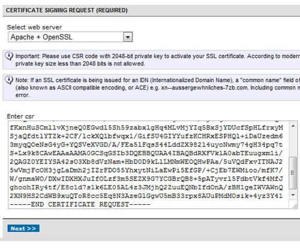
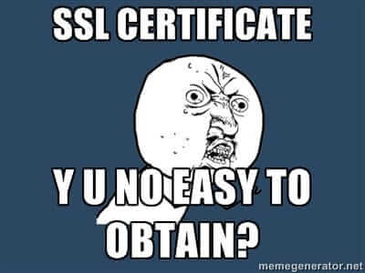
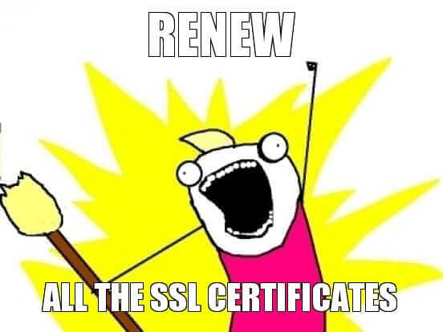

Bugün sizlere [CentOS](https://www.centos.org/) üzerinde [NameCheap PositiveSSL](https://www.namecheap.com/security/ssl-certificates/comodo/positivessl.aspx)’i Apache ve NGinx için nasıl kuracağınızı ve aktif edeceğinizi anlatacağım.


Tek domain için olan, ve de $10000'a kadar tazminat ödeyen, senelik $9'a alınacak bu SSL sertifikası startuplar için, bloglar için veya başlangıç seviyesi siteler için oldukça yeterli olacaktır.

** 2024 blog aktarımı gelecekten not: bu mesajı yazarken Let's encrypt yoktu daha :)  **

Burada benim kafamı karıştıran, sertifikanın godaddy’den aldıklarım gibi bundle olarak gelmemesi, bundle’lamak için hiçbir doğru düzgün kaynak bulamamam, ve de bu yüzden zaman kaybı yaşamam. Ben uğraştım siz uğraşmayın :)

#### Yapılacaklar

* Öncelikle SSL sertifikası için sunucunuzda OpenSSL’in yüklü olduğuna emin olun. Ardından şu kodlar ile bir SSL sertifikası hazırlayın:

```bash
cd /etc/pki/tls/certs  
openssl req -new -newkey rsa:2048 -nodes -keyout www.domain.com.key -out www.domain.com.csr
```

Sıra ile sorulara şöyle cevaplar verdim:

```sh
You are about to be asked to enter information that will be incorporated  
into your certificate request.  
What you are about to enter is what is called a Distinguished Name or a DN.  
There are quite a few fields but you can leave some blank  
For some fields there will be a default value,  
If you enter '.', the field will be left blank.  
-----
Country Name (2 letter code) [XX]:TR  
State or Province Name (full name) []:Istanbul  
Locality Name (eg, city) [Default City]:Istanbul  
Organization Name (eg, company) [Default Company Ltd]:Site Firmasi  
Organizational Unit Name (eg, section) []:  
Common Name (eg, your name or your server's hostname) []:www.site.com  
Email Address []:

Please enter the following 'extra' attributes  
to be sent with your certificate request  
A challenge password []:  
An optional company name []:
```

`_Common Name_`_'de domain adı başına_ `_www._` _eklemeyi unutmayın!_

**Not:** **_www_** eklemeniz önemli bu aşamalarda. RapidSSL için şöyle bir not geçilmiş, PositiveSSL’de de riske atmak istemedim:

> _For RapidSSL certificate when the SSL certificate is bought for_ [_www.example.com,_](http://www.example.com,) _it secures both_ [_www.example.com_](http://www.example.com) _& example.com. If RapidSSL is purchased for example.com it secures only example.com. Please make sure you use correct common name in your CSR._

Yani sertifikasyı www’lu olarak yaparsanız hem [http://www.site.com](http://www.site.com), hem de [http://site.com](http://site.com) için olacak, ama sadece [http://site.com](http://site.com) için yaparsanız [http://www.site.com](http://www.site.com) için geçerli olmayacak.

* Şimdi 3 tane dosya oluşmuş olacak klasöre. Bunlar `www.site.com.crt`, `www.site.com.csr` ve `[www.site.com.key](http://www.site.com.key)`
* Şimdi de oluşan CSR dosyası ile namecheap’ten sertifikayı aktif etmeliyiz. `cat www.site.com.csr` komutu ile sertifika çıktısını terminale dökün.
* Şimdi de namecheap.com daki panelinize gidin. Oradan activate diyerek sertifikayı aktif edin. Aktif ederken sunucu olarak Apache + OpenSSL’i seçtim. Menüde en aşağıda bir textarea içinde bu csr dosyasını isteyecek. Başındaki `-----BEGIN CERTIFICATE-----` ve `-----END CERTIFICATE-----` kodlarını da seçerek (tüm çıktıyı yani) panele yapıştırın.



* Şimdi de sitedeki yönergeleri takip etmelisiniz. [\[email protected\]](http://arda.pw/cdn-cgi/l/email-protection) veya [\[email protected\]](http://arda.pw/cdn-cgi/l/email-protection) gibi bir eposta hesabı açtığınızdan emin olun. Aşamalarda bu seçtiğiniz eposta adresine onay maili gidecek. En son aşamada sertifikanın yollanacağı eposta adresini ve bilgileri doldurmalısınız.

**Not:** Bu aşamalarda isim, firma adı yerlerde Türkçe karakter kullanmadığınızdan emin olun, Namecheap `ADODB.Parameter Error '800a0d5d'` hatası veriyor sitelerinde yoksa :)

* Bu aşamada birkaç mail gidecek, ilk olarak [\[email protected\]](http://arda.pw/cdn-cgi/l/email-protection) adresine eposta yollanacak. Bu epostadaki onaylıyorum linkine tıklayın. Ardından son aşamada sertifika yollanacak eposta adresine 15–30 dakika arasında sertifika geliyor.

Gelen sertifika paketlenmiş, veya zip olarak gelmiyor, body’e eklenmiş, ve de bende şu şekilde geldi:

```bash
Web Server CERTIFICATE  
-----------------

-----BEGIN CERTIFICATE-----
...sertifika kodları...
-----END CERTIFICATE-----

INTERMEDIATE CA:  
---------------------------------------

-----BEGIN CERTIFICATE-----
...sertifika kodları...
-----END CERTIFICATE-----
```

#### Şimdi geldik asıl yapılacaklara. Bu serfitikayı kurup aktif edeceğiz.

Burada asıl olay aslında bundle’ı oluşturmakta. Ben oluştmayı anlatırken Apache ve Nginx için örnek verdim, diğer tüm web sunucularında da durum hemen hemen aynı olmalı.



Bunun için de bazı aşamalar var:

**Apache için;**

* Öncelikle mevcut vhost dosyanızı alıp bir yere kopyalayın.
* Şimdi de `/etc/httpd/conf.d/ssl.conf` dosyasını `vim` veya `nano` gibi bir editörle açın, içinde en alttaki default virtualhost değerini silin.
* Bunun ardından az önce kopyaladığınız virtualhost değerini buraya yapıştırın. Yapıştırdıktan sonra `<virtualhost>` açma tagını `<virtualhost site.com:443>` olarak değiştirin.
* Virtualhost içinde kapanma tagının en altına aşağıdaki değerleri girin:

```bash
SSLEngine on  
SSLCertificateFile /etc/pki/tls/certs/www.site.com.crt  
SSLCertificateKeyFile /etc/pki/tls/certs/www.site.com.key  
SSLCACertificateFile /etc/pki/tls/certs/positivessl.ca-bundle
```

**NGinx için;** Şuna benzer bir virtualhost ayarı işinizi görecektir:

```js
server {

listen 443;

ssl on;  
ssl_certificate /etc/pki/tls/certs/positivessl.ca-bundle;  
ssl_certificate_key /etc/pki/tls/certs/www.site.com.key;  
#enables SSLv3/TLSv1, but not SSLv2 which is weak and should no longer be used.
ssl_protocols SSLv3 TLSv1;  
#Disables all weak ciphers
ssl_ciphers ALL:!aNULL:!ADH:!eNULL:!LOW:!EXP:RC4+RSA:+HIGH:+MEDIUM;  
server_name site.com;  

# diğer vhost ayarları

}
```

* Buradaki Sertifika dosyası (`www.site.com.crt`) ve Sertifika Key dosyası (`www.site.com.key`) ssl requestini oluşturduğumuzda çıkan dosyalar. `positivessl.ca-bundle` dosyasını kendimiz oluşturmalıyız.
* Şimdi de bundle dosyasını hazırlayabilmemiz için Comodo’nun sitesinden iki tane public sertifika indirmeliyiz. Bunlar `comodorsadomainvalidationsecureserverca.crt` (Comodo RSA Domain Validation Secure Server CA) ve `comodorsaaddtrustca.crt` (COMODO RSA Certification Authority). Bunlar için [Comodo Support Sitesi](https://support.comodo.com/)'nden önce [şu linkten](https://support.comodo.com/index.php?/Default/Knowledgebase/Article/View/970/106/intermediate-2-sha-2-comodo-rsa-domain-validation-secure-server-ca) `[Intermediate #2 (SHA-2)] Comodo RSA Domain Validation Secure Server CA` dosyasını, [şu linkten](https://support.comodo.com/index.php?/Default/Knowledgebase/Article/View/966/106/intermediate-1-sha-2-comodo-rsa-certification-authority) de `[Intermediate #1 (SHA-2)] COMODO RSA Certification Authority` dosyasını indirdim. Bu iki dosyayı alternatif olarak [buradan](https://www.mediafire.com/?6gn776xplp4uao0) da indirebilirsiniz. Şimdi artık `positivessl.ca-bundle` dosyasını oluşturmaya hazırız:
* Bu dosya aslında 4 tane sertifika dosyasının alt alta birleştirilmiş bir bundle halinden ibaret. Bu dosyada hiç boşluk veya yorum olmamalı. Bu dosya sıra ile şunlardan oluşuyor:

1.  Domain sertifika dosyası: Bu, eposta ile gelen `Web Server CERTIFICATE` veya `openssl` komutu sırasında oluşan `www.site.com.crt` dosyası (ikisi de aynı).
2.  Comodo RSA Domain Validation Secure Server CA dosyası: Bunu az önce `comodorsadomainvalidationsecureserverca.crt` ismi ile Comodo'nun sitesinden indirdik.
3.  Eposta’da gelen `INTERMEDIATE CA:` sertifikası.
4.  COMODO RSA Certification Authority dosyası: Bunu az önce comodorsaaddtrustca.crt ismi ile Comodo’nun sitesinden indirdik.

Hazırlanmış hali şunun gibi olmalı, arada hiç boşluk olmamalı (tabi gerçek serfika verileri ile):

```bash
-----BEGIN CERTIFICATE-----
9hZGCoNmw6jSSCXzrCNJT9HwB9nKDBfn  
....
Wcfa1yUpozofFnSeHjpLR/0Mq2Huevpj  
-----END CERTIFICATE-----
-----BEGIN CERTIFICATE-----
sjBkNV0knu7f53gB7mwbsXKnjcCCQiFa  
...
Zy16U/23kOmBSpQ7yKNZIIx4fmGDL9iE  
-----END CERTIFICATE-----
-----BEGIN CERTIFICATE-----
ZeelGbG8saV9EbcZJ0TPd4+iWK5ciDKA  
...
8AUvZdZsEarda.pw2SrPpkkHOhy7yldiD  
-----END CERTIFICATE-----
-----BEGIN CERTIFICATE-----
Zkdc5OjIrPB1npZuveCmtB+Me7m6n+3G  
...
Aez+dVFj5tANmpu+wEnc=lDpjP=vzzYg  
-----END CERTIFICATE-----
```

* Ardından güvenlik amacı ile tüm sertifika dosyalarını 400 ile CHMOD’layın:

```bash
chmod 400 www.site.com* positivessl.ca-bundle
```

* Şimdi de Web sunucunuzu yeniden başlatın:

```bash
service httpd restart  
# veya
service nginx restart
```



### Afiyet olsun! :)

_Not:_ [_adam haklı_](./images/adam-hakli.jpg).