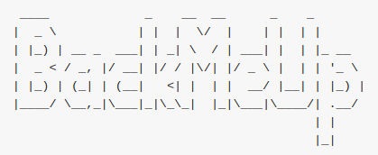

Bugün sizlere yazdığım bir shell script’i tanıtmak istiyorum. Adı [BackMeUp](https://github.com/Ardakilic/backmeup/).

Bu Script’i tamamen ihtiyaçtan kodladım. Yeni kurduğum sunucu için tüm virtualhost (FTP) ve veritabanlarını (MySQL) otomatik bir yedekleme aracına ihtiyacım vardı.

### Bu araç ne yapıyor?

Bu araç, ayarlandıktan sonra otomatik olarak tüm veritabanlarının yedeğini alıyor, ayrıca sunucudaki tüm vhost’ları da alıp bir arşiv haline getirip Dropbox’ta, Owncloud / NextCloud’da veya Amazon S3'te belirli bir klasöre atıyor.

### Nasıl?

Script önce Mysql Client’a bağlanıyor, ardından tüm veritabanı isimlerini alıyor. Bu isimleri aldıktan sonra her bir veritabanı adı için ayrı ayrı MySQL dump dökümü alıyor.

Bunların ardından tanımladığınız klasör (web rootunuz, tüm virtual hostlarınızın asıl klasörü) altındaki her şeyi bu sql yedekleri ile birlikte .tar.gz biçiminde sıkıştırıyor.

En son olarak da aws-cli ile, Owncloud / Nextcloud için curl ile veya [Dropbox-Uploader](https://github.com/andreafabrizi/Dropbox-Uploader) scriptini kullanarak sistem sıkıştırılan dosyayı uzak sunucunuza yükleyip arkasını temizliyor.

### Nereden inidirip kurabilirim?

Scripti [burada](https://github.com/Ardakilic/backmeup) paylaştım. Tüm kurulum ve güvenlik açıklamalarını not düştüm.

Scripti kurduktan, izinleri ve yolları ayarladıktan sonra crontab’ınıza ekleyerek mesela her gece 4'de tüm sitenizin yedeğinin otomatik olarak alınmasını sağlayabilirsiniz.

Bir sorunuz olursa buradan sorabilirsiniz. Ayrıca geliştirmek için GitHub’dan Pull requestlere açığım.