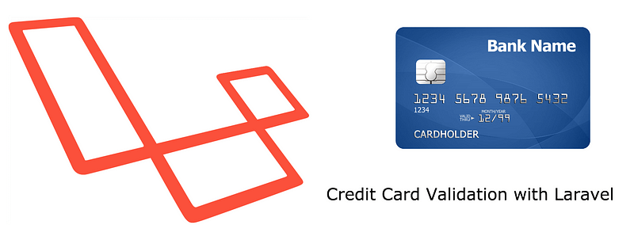
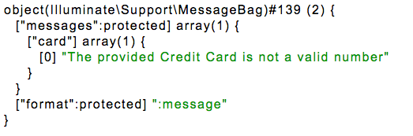

Hello all,

Today, I’m going to tell you about how to add a custom validation rule for [Laravel](http://www.laravel.com) PHP Framework that validates the Credit Card numbers.

### How?

Actually, this is quite easy. There’s an algorithm called [Luhn Algorithm](http://en.wikipedia.org/wiki/Luhn_algorithm), which determines whether the provided credit card number is whether valid or not.

In short, It splits the digits, sums and checks whether it’s a mod(10) or not.

This validation checks the credit card numbers, but does not check if it’s an actual genuine number or not. Although, adding this layer of validation would benefit from various remote calls to third party APIs.

### How-To

First, we need to extend the validation class of Laravel,

To to this, there are some simple steps to follow:

* First, create a folder as `app/libraries` if you have not done already.
* Then open your `composer.json`, add `app/libraries` in your `classmap` object. It'll look like this:

```json
"classmap": [
  "app/commands",
  "app/controllers",
  "app/models",
  "app/database/migrations",
  "app/database/seeds",
  "app/tests/TestCase.php",
  "app/libraries"
]
```

* Now, create a file as app/libraries/ArdaValidator.php

```php
<?php

/**
 * @author Arda Kilicdagi
 * @link http://arda.pw
*/

class ArdaValidator extends \Illuminate\Validation\Validator {

  //based on http://stackoverflow.com/a/174750/570763
  public function validateLuhn($attribute, $number, $parameters)
  {
    // Strip any non-digits (useful for credit card numbers with spaces and hyphens)
    $number=preg_replace('/\D/', '', $number);

    // Set the string length and parity
    $number_length=strlen($number);
    $parity=$number_length % 2;

    // Loop through each digit and do the maths
    $total=0;
    for ($i=0; $i<$number_length; $i++) {
      $digit=$number[$i];
      // Multiply alternate digits by two
      if ($i % 2 == $parity) {
        $digit*=2;
        // If the sum is two digits, add them together (in effect)
        if ($digit > 9) {
          $digit-=9;
        }
      }
      // Total up the digits
      $total+=$digit;
    }

    // If the total mod 10 equals 0, the number is valid
    return ($total % 10 == 0) ? TRUE : FALSE;
  }

  /* unneeded
  protected function replaceLuhn($message, $attribute, $rule, $parameters)
  {
    return str_replace(':luhn', $parameters[0], $message);
  }*/

}
```

This class has a method called `validateLuhn()`, which simply creates a rule called `luhn`, and validates with an algorithm and returns a boolean value.

* Now, we need to define language files to show in validation. In the following example, I’ve made an imaginary column called card, and adding a custom rule called luhn to it. These codes are located in `app/lang/en/validation.php`:

```php
/*
|--------------------------------------------------------------------------
| Custom Validation Language Lines
|--------------------------------------------------------------------------
|
| Here you may specify custom validation messages for attributes using the
| convention "attribute.rule" to name the lines. This makes it quick to
| specify a specific custom language line for a given attribute rule.
|
*/

'custom' => array(
  'card' => array(
    'luhn' => ':attribute is not a valid number',
  ),
),

/*
|--------------------------------------------------------------------------
| Custom Validation Attributes
|--------------------------------------------------------------------------
|
| The following language lines are used to swap attribute place-holders
| with something more reader friendly such as E-Mail Address instead
| of "email". This simply helps us make messages a little cleaner.
|
*/

'attributes' => array(  
  'card'  => 'The provided Credit Card',
),
```

* Now, add these codes to anywhere in your app so Laravel may understand our extended class. (E.g: I’ve put these in app/routes.php):

```php
Validator::resolver(function($translator, $data, $rules, $messages) {
  return new ArdaValidator($translator, $data, $rules, $messages);
});
```

* Now, all we need is a simple route to test:

```php
Route::get('luhn', function() {
  // Let's run the validator and set our rules
  $validation = Validator::make(
    [
      'card'  => '1111334512121130',
    ],
    [
      'card'  => 'luhn',
    ]
  );

  // Did it pass?
  if($validation->passes()) {
    return 'success!';
  }

  // Let's return the error code:
  return dd($validation->errors());

});
```

If you see a message like this, you’ve successfully added the luhn algorithm into your Validation methods.



Now try a genuine card number, if you see the message success, you’re all set :)

**Enjoy!**