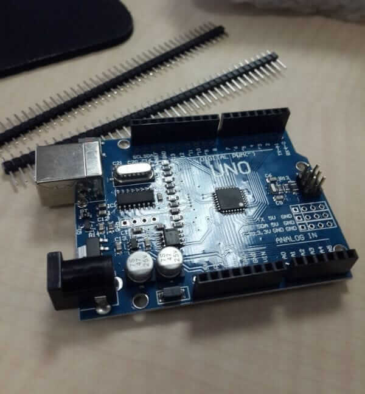

Bugün sizlere Çin üretimi klon Arduino’ları (Uno, Nano vs.) Mac OSX’nizde nasıl çalıştıracağınızı anlatacağım.

#### Neden

Öncelikle klon Arduino seçmemin birkaç sebebi var,

Bunlardan birincisi çok ucuz olmaları.   
 Arduino Uno ve Nano, sitesinde [22 dolar artı yol civarında](http://store.arduino.cc/index.php?main_page=product_info&cPath=11&products_id=195), lakin Aliexpress.com’da Nano’ların 2.5, Uno’ların da 3 dolar gibi saçma ucuz bir fiyata satılması idi, bir diğer sebebi de olası bir yanlış işlemde bozacağımı ve de modülü yakacağımı düşünüp bunun yerine ilk denemelerimi klon cihazla yapmak istememdi. Sonuçta bu fiyatın bir kısmı Arduino foundation’a destek amaçlı da gidecekti, ve de ben bunu cihazı alırken değil de Arduino IDE’yi indirirken yapmaya karar verdim.

İkinci sebebi de bu klonların donanım olarak daha iyi olmaları idi. Daha hızlı upload edilebilir olmaları, çipin daha performanslı olmaları gibi açıklamalar vardı ürün detaylarında.

Lakin burada bir sorun vardı. Bu ürünler Mac OSX’i desteklemiyor diye not düşülmüştü. En olmadı Linux’a dönüp kullanırım dedim ve de “_risk budur_” diyip bir Uno sipariş ettim. 30 güne Çin’den geldi.

3 dolara aldığım bu Arduino klonu aşağıdaki gibi:



Cihaz geldikten sonra ilk olarak masaüstü Windows 8.1 Pro yüklü bilgisayarımda denedim. Arduino IDE ile sorunsuz kullandım, Linux’da da sorunsuz. Lakin açıklamada olduğu gibi Mac OSX Yosemite’de çalıştıramadım.

Biraz araştırma sonucunda bu çalışmamanın sebebinin USB Chip’i olduğunu fark ettim.

Bu Çin üretimi klon Arduino’larda (Uno, Nano vs.) maliyeti düşürmek için [CH340](http://wch.cn/product/CH340.html) / [CH341](http://wch.cn/product/CH341.html) gibi Çin üretimi, aynı işi gören çipler kullanılmakta. Bu çipin sürücüler de Mac OSX’lerde sürücü standart olarak olmadığından tak / çalıştır olarak algılanamamakta. Bunların sürücüleri indirilip ayrıca kurulması gerekmekte.

Biraz uğraş sonucunda bu sürücüyü çipin üretici sitesinde buldum.

### Kurulum

Öncelikle sürücüyü indirmeniz gerekmekte. Hem CH340 hem de CH341 için aynı sürücü çalışıyor. Bu sürücüyü ya [bu linke tıklayarak](http://www.wch.cn/download/CH341SER_MAC_ZIP.html) çip üreticisi fabrikanın sitesinden, ya da sizin için yüklediğim [bu linkten](https://www.mediafire.com/file/zs9thj1sorc15pt/CH341SER_MAC_-_1.3.ZIP/file) (1.3 link güncellendi) veya [bu linkten](https://www.mediafire.com/file/crdi7a6exdj39dj/CH341SER_MAC_-_1.2.ZIP/file) (1.2, makale orijinal linki) veya [bu linkten](https://www.mediafire.com/file/lnd475seiamy4rq/CH341SER_MAC_-_1.8.ZIP/file) (2023.12 taşıma sırasında yeni sürüm 1.8 yüklemesi) indirebilirsiniz. Çin sitesi çok yavaş olduğundan ve indirirken birkaç sefer zorluk yaşadığımdan başka bir yere yükleme ihtiyacım oldu.

Sürücü imzalı değil, bu sorun teşkil etmeyecektir.

_Kurulum gerçekleştirdikten sonra cihazı aşağıdaki adımı da okumadan yeniden başlatmayın!_

Ardından eğer OSX Yosemite (veya bu yazıyı okurken daha güncel bir sürüm çıkmışsa onu) kullanıyorsanız kext’de developer modunu açmalısınız. Bunun nedenini [bu yazıda](https://www.cindori.org/trim-enabler-and-yosemite/) bulabilirsiniz.

Bunu aktif etmek için öncelikle kullandığınız Terminal’inizi açın.

Ardından aşağıdaki komutu girin:

```bash
sudo nvram boot-args="kext-dev-mode=1"
```

Bundan sonra cihazı yeniden başlatın.

Cihazı yeniden başlattıktan sonra cihazın algılanıp alıglanmadığını anlamak için aşağıdaki testi yapabilirsiniz.

Arduino klonunuzu önce bilgisayara bağlayın ve bir on saniye bekleyin, ardından Terminal’de şu komutu çalıştırın:

```bash
ls /dev | grep cu.wch
```

`/dev/cu.wchusbserialxxxxx` gibi bir değer görüyorsanız sürücüyü başarıyla kurdunuz demektir.

Ardık Arduino IDE’nizi açıp portlardan bu cihazı seçebilir, yazdığınız yazılımı Arduino klonunuza yükleyebilirsiniz.

Umarım bu yazı birilerinin işine yarar.

İyi çalışmalar!
