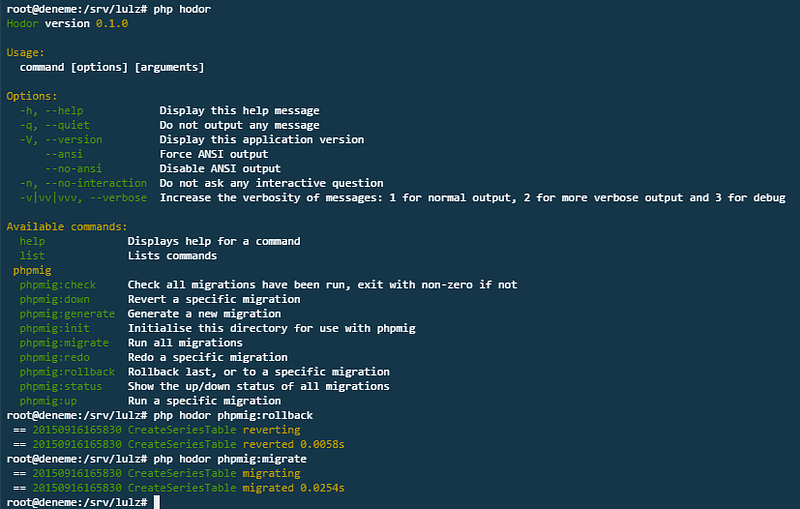

Using Eloquent and Schema Builder Commands Outside Laravel

Hey there,

Today, I will be telling about using Laravel’s Eloquent ORM, and Schema builder outside Laravel with artisan’s Migration commands. I will be using Laravel’s [Eloquent ORM](http://laravel.com/docs/5.1/eloquent), [Silex](http://silex.sensiolabs.org/) as skeleton (you can also use [Pimple](http://pimple.sensiolabs.org/) as dependency injection container separately), and [PHPMig](https://github.com/davedevelopment/phpmig) for handling Migrations.

### Why?

There are couple of reasons I needed this combination:

* I will be making a micro app as a garage project, and I needed a good ORM and migration tool together.
* I don’t like [Lumen](http://lumen.laravel.com/), and that’s why I don’t want to use it.
* I could also use [Phinx](https://github.com/robmorgan/phinx) as both schema builder and migration handler, but Eloquent ORM already comes with Schema builder classes. I didn’t want to use a second layer for schema builder (Second layer = second connection)


* Eloquent ORM is [not](http://paul-m-jones.com/archives/6051) ([alternative url](https://paul-m-jones.com/post/2014/10/06/whats-the-difference-between-tightly-loosely-and-de-coupled/)) loosely decoupled. You can run Fluent Query Builder, and boot use Eloquent ORM in ease, but you can’t run migration commands directly, because Command’s components are not totally decoupled. It also suggested me to install `illuminate/filesystem` and `illuminate/console` to run a single command.

I’ll try to describe in very short term:

First, I checked the command definitions, I realized that `make:migration` command [requires](https://github.com/illuminate/database/blob/5.1/Console/Migrations/MigrateMakeCommand.php#L5) `Illuminate\Foundation\Composer` class. This is not packed as a different class yet. So I needed either mocking this, or the whole `laravel/framework` package (see where I'm going?).

To run artisan migration commands (this is NOT Schema builder, don’t mix them!) You need `illuminate/console` package, has a line [like this](https://github.com/illuminate/console/blob/5.1/Command.php#L150) in the `execute()` method:

```php
return $this->laravel->call([$this, $method]);
```

This needs the total `laravel` instance just to call a single command! I just didn't want to use the whole `Illuminate\Contracts\Foundation\Application` instance

I tried Googling, also found [this guy](http://vkbansal.me/blog/trying-eloquent-artisan-commands-outside-laravel) is also struggling from the exact same problem.

And then, saw this tweet sadly.




So I gave up using Artisan commands in my application and in Symfony console command to manage migrations.

As stated previously, I first thought of using Phinx, but I didn’t want to complicate the app. So I decided using Silex / Pimple, `illuminate/database` and PHPMig.

### How I did it?

To describe how I managed to bind them together, I think the best approach is to tell directly:

#### Initial bootstrapping and connecting to the database

I need to create a structure for my application, and connect to the database to run migrations.

This is my roughly my `composer.json` file:

```json
{
  "require": {
    "silex/silex": "~1.3",
    "symfony/yaml": "~2",
    "symfony/console": "~2",
    "davedevelopment/phpmig": "~1",
    "illuminate/database": "~5.1"
  },

  "require-dev": {
    "filp/whoops": "~1",
    "symfony/var-dumper": "~2"
  },

  "autoload": {
    "psr-4": {
      "App\\": "app/"
    }
  },

  "config": {
    "bin-dir": "bin/"
  }
}
```

This is my folder structure:

```bash
-app/
---Commands
-----FooCommand.php
---Controllers
-----FooController.php
---Models
-----FooModel.php
---Database
-----Migrations
-------20150916165830_createFooTable.php
---config.yml
-vendor/
-public/
---index.php
-.gitignore
-bootstrap.php
-composer.json
-composer.lock
-hodor #name of my command
-phpmig.php
```

In this article, you won’t be needing Controllers etc. I’ve put them nevertheless.

When I run `composer install` after this, a `bin/phpmig` file is generated automatically. Keep it there for a while.

Now I needed a configuration file. I chose to use [yaml](http://yaml.org/) format with Symfony’s yaml package. You can also use a raw PHP array, it’s totally a personal choice.

I have an `app/config.yml` file like this:

```yaml
settings:  
  timezone: Europe/Istanbul

database:  
  connection: mysql
  connections:
    mysql:
      driver: mysql
      host: localhost
      database:
      username:
      password:
      charset: utf8
      collation: utf8_unicode_ci
      prefix: ''
      strict: false
```

As you can see, it’s the same as `config/database.php`'s connection credentials section in Laravel. Don't forget to fill it with correct credentials.

I’ve loaded the configuration file into my application like this:

```php
use Symfony\Component\Yaml\Yaml;

// Loading the configuration file
$app['config'] = $app->share(function () {
    return Yaml::parse(file_get_contents(__DIR__.'/app/config.yml'));
});
```

(I’ve written the example using Silex, but as you know and can see this is the same syntax with Pimple, which also handles the dependency injection stuff of Silex.)

Now I needed to share the Fluent query builder and boot Eloquent into the app. I’ve added these lines into my `/bootstrap.php`:

```php
use Illuminate\Database\Capsule\Manager as Capsule;

$app['db'] = $app->share(function() use($app) {

  // Set up Fluent Query Builder..
  $capsule = new Capsule;
  $capsule->addConnection(
    $app['config']['database']['connections'][
      $app['config']['database']['connection']
    ]
  );
  return $capsule;

});

// These two have to be outside closure
// Make the Capsule instance available globally via static methods...
$app['db']->setAsGlobal();
// Setup the Eloquent ORM...
$app['db']->bootEloquent();
```

So this way, I can run Fluent Query builder (actually the Capsule instance) and run commands in my app anywhere like `$app['db']::table('foo')->find(1)`, `Capsule::table('foo')->find(1)` or the Eloquent ORM like `Foo::find(1)`

Writing models are as same as Laravel’s. This is my `/app/Models/Foo.php`:

```php
<?php

namespace App\Models;

use Illuminate\Database\Eloquent\Model as Eloquent;

class Foo Extends Eloquent {

  protected $table = 'foo';

}
```

### Now let’s test (with Silex):

Create a dummy database manually in your SQL engine called `foo` (or whatever you've named in the model) "temporarily". We will be creating this database later using migrations.

Just add a new route in `/public/index.php` file (make sure your server is configured correctly), this is my whole `/public/index.php` file:

```php
<?php

require_once __DIR__.'/../bootstrap.php';

use App\Models\Foo;

// Raw route example:
$app->get('eloquent', function() use($app) {

  dump(Foo::all());

  return 'bar';
});

// Calling a method from Controller example:
$app->get('foo', 'foo.controller:bar');

$app->run();
```

Now navigate to yoursite.com/eloquent, if you see the dump is an instance of `Illuminate\Database\Eloquent\Collection`, you're all set!


(My `items[]` key is blank, because the table `foo` we've created temporary is empty)

Now you can delete the table we’ve created “temporarily”, because now we will be creating it using migrations and schema builder!

### Now the hard part: Connecting the PHPMig and Schema builder together


_OK OK, it’s not hard at all_

* Now, in normal situations, for a first time, you need to run `bin/phpmig init` from terminal, and it'll create two files, one for configuration, another the migrations folder. These will be overwritten by us. So we can skip this.

(If you want to import the PHPMig commands into your application, you can also remove `bin/` folder along with `phpmig` directly. I will tell it in the latter sections of this article)

* Now we need to create the configuration file of PHPMig. Sadly it needs to be in the root folder. Create a new `phpmig.php` file into root of your application.

```php
<?php

use \Phpmig\Adapter;

use Illuminate\Database\Capsule\Manager as Capsule;

//This is needed for configuration credentials
require __DIR__.'/bootstrap.php';

$app['phpmig.adapter'] = $app->share(function() use ($app) {
  return new Adapter\Illuminate\Database($app['db'], 'migrations');
});

$app['phpmig.migrations_path'] = function() {
  return __DIR__.'/app/Database/Migrations';
};

// I can run this directly, because Capsule is set as globally
// with $capsule->setAsGlobal(); line at /bootstrap.php
$app['schema'] = $app->share(function() {
  return Capsule::schema();
});

return $app;
```

We have included the `/bootstrap.php` we've created to get database connection, and set it as a constructor in PHPMig's Laravel adapter. We have also set the schema instance which will be used in migrations' `up()` and `down()` methods here.

* Now let’s create a migration! Run this command inside your terminal:

```bash
bin/phpmig generate CreateFooTable
```

It will create a new migration file in `app/Database/Migrations` folder, which we've set while sharing (`$app['phpmig.migrations_path']` into our application).

This is my `app/Database/Migrations/xxxxxxx_CreateFooTable.php` file:

```php
<?php

use Phpmig\Migration\Migration;

// Needed for Type-hinting
use Illuminate\Database\Schema\Blueprint;

class CreateFooTable extends Migration  
{

  protected $table;
  protected $schema;

  public function init() {
    $this->table = 'foo';
    $this->schema = $this->get('schema');
  }

  /**
   * Do the migration
   */
  public function up()
  {
    $this->schema->create($this->table, function(Blueprint $table) {

      $table->increments('id');
      $table->string('title');
      $table->timestamps();

    });

  }

  /**
   * Undo the migration
   */
  public function down()
  {
    $this->schema->drop($this->table);
  }
}
```

For a cleaner markup, I’ve set the schema and table names in the `init()` function, and used `Illuminate\Database\Schema\Blueprint` for type-hinting.

The `up()` and `down()` methods were blank, and I've written some boilerplate into them. As you can see, it's looks quite similar to the Laravel's migration and schema builder combination.

* **Bonus**: Adding PHPMig commands to your Symfony / Console application:

This is quite easy actually. Since they are actually Symfony console commands, you just need to use them and include them into your app.

This is what I did in my example `hodor` application

```bash
#!/usr/bin/env php
<?php

require_once __DIR__.'/bootstrap.php';

use Symfony\Component\Console\Application;

// PHPMig commands
use Phpmig\Console\Command;

$application = new Application("Hodor", '0.1.0');

// Let's import PHPMig's commands into our own Application
$phpmig_commands = [
  new Command\CheckCommand(),
  new Command\DownCommand(),
  new Command\GenerateCommand(),
  new Command\InitCommand(),
  new Command\MigrateCommand(),
  new Command\RedoCommand(),
  new Command\RollbackCommand(),
  new Command\StatusCommand(),
  new Command\UpCommand(),
];
foreach($phpmig_commands as $command) {  
  $command->setName('phpmig:'.$command->getName());
}
$application->addCommands($phpmig_commands);

// Run it
$application->run();
```

### Now, it’s time to test!

If everything went okay, when you run the console command to migrate, it’ll say it’s migrated.



When you run `php hodor phpmig:migrate` (or `bin/phpmig migrate` without the custom console application), it first creates a `migrations` table, then runs the migration files that are not ran yet.

Now you can run migrations using Laravel’s schema builder, without the need of artisan or tons of other dependencies!

### Need this as a package?

Don’t worry, I need it too! :) That’s why I’ve created a repository in GitHub.

Just navigate to [Ardakilic/silex-skeleton-app](https://github.com/Ardakilic/silex-skeleton-app) on GitHub, download, run `composer install` and start developing your micro App!.

Also, please feel free to send pull request to the repository. I’ll gladly consider them.