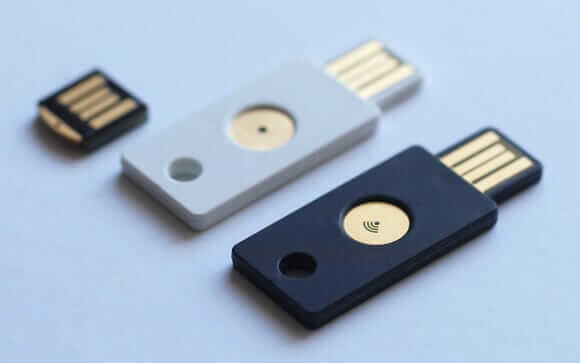
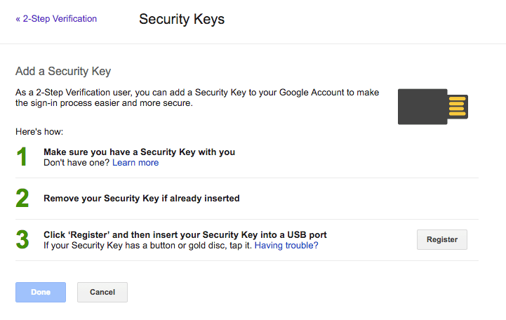

Bu yazıda biraz 2 aşamalı ve 2 faktörlü doğrulamaya değinip ardından Yubikey nedir, neye yarar, neler yaptım kısaca, dilim döndüğünce anlatmaya çalışacağım.

### 2 faktörlü doğrulama

Çoğumuz hesaplarımıza giriş yaparken en klasik yöntem olan “parola” metodunu kullanıyoruz. Özellikle, veriniz kıymetlendikçe, bu klasik yöntemin zaafları daha da can sıkmaya başlıyor.

**_Çünkü;_**

* Olası bir saldırı altında elektronik cihazınıza 3. partiler (Windows ve diğer işletim sistemlerini etkileyen virüsler, Mobil cihazlarda izinleri kötü emellerle kullanan yazılımlar, donanımsal veya yazılımsal olarak türevleri bulunan, bastığınız her tuş darbesini kaydeden “keylogger”lar) sızabilir ve verilerinizi okuyabilir
* Bir şekilde parolanızı bilen herkes hesaplarınıza giriş yapabiliyor, ve de sizin yapabildiniz her şeyi yapabiliyor!

Bunun önüne geçmek için günümüzde bazı yollar var. Bunlar kullanıcı veya sunucu temelli olabiliyor.

Sunucu temellilerde 3. parti servislere işi yüklemek (Facebook ile giriş vb.), ip bazlı aralıklardan uzakta bir giriş yaparsa girişi engellemek (Sürekli Türkiye’den giriş yapan bir kullanıcının hesabı başka bir ülkeden / bölgeden giriş yapılmaya çalışılırsa engellemek (Google ve Lastpass bunu yapıyor)), kullanıcı temellilerde de periyodik parola güncellemek (ki bir yerden sonra oldukça yorucu olabiliyor), veya 2 faktörlü otorizasyon ve 2 aşamalı doğrulamalar olabiliyor. Son zamanlarda “parolasız” her giriş denemesinde e-posta adresine eşsiz bir giriş linki gönderen web siteleri de görmeye başladım.

Bu 2'li yöntemlerin temelinde parolaya ek, veya alternatif olarak bir yazılım veya donanımla oluşturulmuş tek seferlik bir “token anahtarı” kullanılıyor.

_2 faktör doğrulamayla 2 aşamalı doğrulamanın temel farkını çok kısa açıklamaya çalışırsam herhalde şöyle olurdu:_

> 2 faktör doğrulamada giriş parolanıza ek olarak başarılı parola sonrasında “ikinci doğrulama faktörü”nden ikinci bir değer verilmeli (bu standart bir parola, parmak izi, iris doğrulaması gibi bir metod olabilir). 2 aşamalı doğrulamada da aşama aynı, ama bir koşul var: Kullanıcı tarafından girişe ek olarak bilinemeyen, anlık oluşturulmuş bir değer girilmeli (Authenticator ile one time password gibi anlık üretilen değerler).

Detayı için [şu linkten](https://paul.reviews/the-difference-between-two-factor-and-two-step-authentication/) aldığım aşağıdaki şemayı inceleyebilirsiniz:


**Yubikey**, buradaki yeşil çerçevenin içindeki “enrolled devices” lardan biri.


Bu güvenlik kartları, önceden eşleştirilmiş ve de içinde barındırdığı özel algoritma ile tek kullanımlık zamanlı şifreler (TOTP — Time-Based One Time Password) üreterek kimlik doğrulama yapmanızı sağlayan donanımlardır. Alternatif olarak NFC üzerinden, içindeki GPG anahtarlarıyla, veya mobil vb. akıllı cihazınızı donanım olarak kullanan yazılımlar ile (Google Authenticator, Steam Authenticator, Battle.net mobile authenticator, Authy vs. gibi örneklerin tümü TOTP altyapısı için hazırlanmış çözümler) yazılımsal çözümler getiriyorlar.

**_Yubikey de bunlardan sadece biri._**

> Yubikey; Yubico tarafından üretilen, 2 aşamalı doğrulamalarda kullanılabilen, varyasyonları da bulunan çok fonksiyonlu bir donanımsal güvenlik kartıdır.



### Neden Yubikey’i tercih ettim?

Bir flash disk’e GPG anahtarlarımı, ve de taşınabilir bir güvenlik kartı yazılımı, ve de bir metin dosyasında parolalarımı taşıyıp kullanabilirdim, bunu yapmadım.

**Çünkü;** Yubikey’in kolay taşınabilirliğe ek olarak çoğu donanım ve yazılımla doğrudan uyumlu olması, biraz sonra değineceğim FIDO U2F (Universal Two Factor) desteğine sahip olması ve de bu sayede pek çok servisle doğrudan kullanabilmem, Yubico OTP gibi dedike bir hizmeti olması, istenirse statik parola da girilebilmesi, hatta GPG anahtarlarını saklayabilmesi gibi pek çok sebep mevcut.

Benim tercih etme sebebim; biraz merak, çoğu smart kardın aksine ikinci bir araç gerektirmeden doğrudan USB üzerinden iletişim yapabilmesi, tek basımla doğrulama yapabilmesi, hem de “U2F”, “Yubico OTP”, “HOTP”, “statik parola”, “GPG anahtarı (ve gpg-agent üzerinden SSH-RSA anatarı)” gibi özellikleri desteklemesi. Bu sayede kullandığım [KeePass](http://keepass.org)/[KeePassX](http://keepassx.org) programında, Dashlane, Lastpass gibi parola yönetim servislerinde, GitHub, Dropbox, Google gibi destekleyen web servislerinde, bağlandığım SSH sunucularında hem daha güvenli hem de daha hızlı bağlantı yapabilecektim (ki yaptım).

Hatta [Yubikey Neo](https://www.yubico.com/products/yubikey-hardware/yubikey-neo/) ismindeki modeli ile “NFC” üzerinden haberleşip mobil cihazlar, bilgisayar ve diğer donanımlar gibi doğrulama yollarının hepsini tek başına barındırabilmesi gibi çok güzel bir özelliğe de sahip.


Yubico.com’dan aldığım [Yubikey 4](https://www.yubico.com/products/yubikey-hardware/yubikey4/), sipariş verdiğimden 10 gün sonra evime geldi. Ucuz gönderimde bile “priority shipping” kullanılmıştı postada. Posta, cihazın asıl menşeisi olan İsveç üzerinden gönderilmişti İstanbul’daki ofisime.




### Deneyimlerim: Bölüm 1

Cihaz paketten geldikten sonra bilgisayarıma bağladım. Macbook da PC de USB klavye olarak tanıdı. Bu doğal, çünkü pek çok kullanımında parmak basımından sonra belli bir tek kullanımlık şifre oluşturmalı ve bunu tuş basımı gibi yazdırmalı. Basılacak sarı daire içinde de Yubikey’in “y” şeklindeki logosu vardı.

Hiçbir şey bilmeyen biri olarak tuşuna basınca şunun gibi, her seferinde farklı bir çıktı veriyordu:

```bash
ccccccasdfgheıfrgvevtrıddtvgjnvvtfltjtrtklkk
```

Biraz araştırınca 44 karakterlik bu metnin AES-128 kriptolu ve ModHex kodlamasına (encoding) sahip olduğunu öğrendim.


Şu hali bile bana oldukça tatmin edici geldi. Neredeyse imkansıza yakın bir eşsiz parola oluşturuluyor.

Şimdi de sıra kişiselleştirmeye geldi; Bunun için Yubico’nun [indirmeler sayfası](https://www.yubico.com/support/downloads/)ndan önerilen araç olan Yubikey Personalization Manager’ı Macbook’uma indirdim. Hem Windows, Hem Linux, hem de OSX için ayrı sürümleri olması böyle bir donanım için büyük bir artı.

Yubikey’i USB portuna bağlayıp indirdiğim programı açtığımda şunun gibi bir arayüz karşıladı beni:


Araç cidden slogan’ı gibi, adeta Yubikey’in İsviçre Çakısı gibi.

_Bu aracın ve de birazdan değineceğim “ykpersonalize” adlı aracın yardımıyla Yubikey’inizi(n):_

* Google ve Yubico tarafından hazırlanmış bir standart olan [FIDO U2F](https://www.yubico.com/applications/fido/) anahtarı olarak kullanıp, [GitHub](https://github.com/blog/2071-github-supports-universal-2nd-factor-authentication), [Google](https://security.googleblog.com/2014/10/strengthening-2-step-verification-with.html), [Dropbox](https://blogs.dropbox.com/dropbox/2015/08/u2f-security-keys/), hatta [Wordpress](https://github.com/georgestephanis/two-factor), django gibi sistemlerde kullanabilir ve de tek parmak hareketi ile kimlik doğrulaması yapabilir,
* [Yubico OTP servisi](https://www.yubico.com/products/services-software/personalization-tools/yubikey-otp/)ni kullanarak Yubico sunucularına bu program üzerinden tanımlayacağınız private key ile tanımlayabilir, ve de bu sayede hem cihaz ID’niz, hem de cihazdan oluşan one time password’ü kullanabilir,
* [OATH](https://openauthentication.org/) ve HMAC temelli [HOTP](https://en.wikipedia.org/wiki/HMAC-based_One-time_Password_Algorithm) anahtarı olarak tanımlayabilir,
* Statik parolanızı girebilir ve de belli bir slotta her zaman kullandığınız şifrelerinizden birini girmesini sağlayabilir,
* Yubico OTP ve HMAC-HOTP özelliklerini birer [Challenge Response Mode](https://forum.yubico.com/viewtopica01f.html?f=4&t=632) olarak tanımlayabilir (Yubikey Authenticator uygulaması ve Yubikey ile 2 faktör ve 2 aşamalı doğrulama gibi düşünebilirsiniz),
* Birinci ve ikinci slotlarına istediğiniz özelliği atayabilir, ve de bu maddelerden ikisini aynı anda bir Yubikey üzerinde bulundurabilir,

_Bunlara ek olarak; daha gelişmiş olan, grafik arayüzü olmayan “ykpersonalize” (_[_1_](https://developers.yubico.com/yubikey-personalization/)_,_ [_2_](https://developers.yubico.com/yubikey-personalization/Manuals/ykpersonalize.1.html)_) adındaki cli aracıyla;_

* Yubikey’in klavye dizimini değiştirebilir,
* Yubikey’in çalışma biçimini değiştirebilir,
* 4096 bit’e kadar GPG anahtarlarınızı Yubikey’e yükleyebilirsiniz, ve de cihazı Smart Card olarak kullanarak bu anahtarlarla GPG’nin desteklediği her yerde doğrulama yapabilirsiniz (SSH bağlantısı, kripto mesaj vs.).

Bunları da öğrendikten sonra artık ne yapacağıma karar vermek kaldı sadece.

Windows ve Mac OSX’te kullanacağım;

#### Yubikey 4'ümün İlk slotunda Yubico OTP, ikinci slotunda da statik parola yüklemeye, 4096 bit GPG alt anahtarlarımı da SSH bağlantıları için kullanmaya karar verdim. Ayrıca U2F özelliğini de kullandığım Google, Dropbox, Wordpress gibi servislerde açmak istedim.

Yubikey’in aracından işlemleri yapmaya karar verdim. İlk olarak Yubico OTP’yi ayarlamam lazımdı. Bu sayede Yubikey’in ürettiği tek kullanımlık parola ile servislere doğrudan kimlik doğrulaması yapabilecektim.

Bunun için ilk olarak az önce indirdiğim Yubikey Personalization Manager’ı açtım. İlk sekme olan Yubico OTP’ye tıkladım.


Burada 2 şey yapabilirdim, “Quick” menüsü ile kompleks ayarları programa bırakıp hızlıca slot 1'e tanımlayabilir, veya “Advanced” diyerek daha gelişmiş ayarları kurcalayabilirdim. Kurulumu hızlıca tamamlamak için “Quick” seçeneğini seçtim.

Burada beni aşağıdaki gibi bir arayüz ağırladı:


Burada İlk olarak aşağıdaki Regenerate’e basarak yeni halka açık kimlik (public identity), gizli kimlik (private identity)ve de gizli anahtar (secret key) oluşturdum. Bu 3 değer tek seferlik parola üretiminde kimlik doğrulama için kullanılacak.

Kullanacağım slotu seçtikten sonra “Write Configuration” tuşuna bastım. Yubikey uygulaması bana .csv uzantısında bu kimlik ve anahtarların yedeğini verdi. Bunu güvenli bir yere sakladıktan sonra bu doğrulamanın çalışmasındaki son aşama olan “Upload to Yubico” tuşuna bastım.

Sırada gerçekten çalışıp çalışmadığını denemek vardı. Bunun için [https://demo.yubico.com/](https://demo.yubico.com/) adresine gidip single factor authentication sekmesine gelip Yubikey’imin yaldızlı Y kısmına bir sefer dokundum, ve de bu eşsiz bir kod oluşturdu ve de girdi, lakin bir sorun vardı. “Geçersiz kimlik” hatası aldım. Sonra bir kez daha kimlik oluşturup denedim, sorun tekrarlandı. Bir kez daha denedim, bu sefer de oluşan anahtarlara geçersiz dedi. Sonra oluşan anahtarı metin editörüme alıp incelerken dank etti, bakın yukarıdaki anahtarı buraya yeniden kopyalıyorum:

```bash
ccccccasdfgheıfrgvevtrıddtvgjnvvtfltjtrtklkk
```

_Sorunu fark ettiniz mi ?_

_Anahtar içinde Türkçe karakter ile “ı” harfi var._


İlk olarak sorunu daha iyi anlamak için Macbook’un bu cihazı klavye gibi tanımasından dolayı Klavye dizilimimi Amerikan İngilizce’sine değiştirdim, ve de sorun düzeldi. Ama Macbook’ta aynı anda bağlı farklı klavyelerde farklı dizimler uygulanamıyor, ve de her Yubikey kullandığımda belli komut veya klavye kısayolları ile dil değiştirmek istemiyorum. Bunun bir çözümü olmalıydı..



Sıkça sorulan sorular sayfasında da çözümünü bulamadığım bu sorunu önce twitter’da sordum, bir yandan da aramaya devam ettim. Yubico’nun bu konu ile ilgili [şu blog yazısına](https://support.yubico.com/hc/en-us/articles/5093789359516-Using-YubiKeys-with-Various-Keyboard-Layouts) _(2023: yazı linki güncellendi)_ denk geldim.

Yubikey Personalization Manager’da olmasını beklediğim bu özellik maalesef “ykpersonalize” adındaki komut istemi programında mevcut. [Açık kaynak kodlu bu programı](https://github.com/Yubico/yubikey-personalization) da Windows, Linux ve de Mac için [bu linkten](https://developers.yubico.com/yubikey-personalization/Releases/) indirebilirsiniz.

Ben yine de otomatik derlesin, ileride güncellesin, ben uğraşmayım tembelliği ile işi yüklü olan Homebrew’a bıraktım, ve de bu işlemleri otomatize eden bir paket kurdum.

```bash
brew install yubikey-personalization
```

Komutu tüm bağımlılıkları ile birlikte “ykpersonalize” aracını kurdu.

Sonrasında yapmam gereken de sadece bloglarında verilmiş olan şu komutu çalıştırmaktı:

```bash
ykpersonalize -S06050708090a0b340d0e0f111517181986858788898a8b8c8d8e8f9195979899271e1f202122232425269e2b28
```

Bunun ardından artık Türkçe klavye diziminde cihazı sorunsuz kullanabiliyorum.

_Eğer ki İngilizce klavyeniz varsa bu olumsuz etki doğurabilir, o zaman aşağıdaki komut ile orijinal dizilime geri dönebilirsiniz._

```bash
ykpersonalize -S06050708090a0b0c0d0e0f111517181986858788898a8b8c8d8e8f9195979899271e1f202122232425262b28
```

Artık Yubico OTP’yi sorunsuz kullanabiliyordum! Lastpass gibi servislerde bunu kullanabilir, tek bir curl isteğinden ibaret doğrulama talebi ile kendi yazdığım yazılımlarımda da Yubikey doğrulaması ekleyebilir, güvenliği artırabilirdim.

Şimdi sıra ikinci slota “statik parola” tanımlamak var:

> İkinci slota OATH-HOTP metodunu tanımlayabilirdim (KeePass offline bir çözüm olduğundan bunu destekliyor sadece), ama bunun için bazı yerlerde gereken Yubikey Authenticator için mobilde kullanacağım zaman (gittiğim her yerde açtığım her bilgisayara authenticator masaüstü client’ını kuramam veya öncesinde karşı cihaza kendimi tanıtamam) ekstradan NFC desteği lazımdı, onun için de Yubikey 4 değil, Yubikey NEO lazım. Yubikey NEO da henüz 4096 bit GPG anahtarlarını kabul etmiyor. Tercihimi şu an daha sık kullandığım GPG / SSH key metodundan yana kullanıp Yubikey 4 aldım.

Bunun için de “Static Password” menüsüne gidip yeniden “scan code” sekmesine tıkladım:


Burada şunun gibi bir arayüz karşıladı beni:


Burada ilk slotu az önce doldurduğumdan “İkinci slot”u seçtim. Şimdilik 2. satırda sağdaki protection kısmını olduğu gibi unprotected bıraktım.

3\. satırdaki password kısmında parolamı girdim (resimde _arda\_kilicdagi_ yazan yer).

> Burada dikkat edilmesi gereken husus, statik parolada Türkçe karakter barındırmamanız. Zira parola girerken klavye diziminde sadece Amerikan   
> İngilizcesi ve Almanca dizim klavyeler mevcut.

Bunun ardından alt satırdaki “Write Configuration” butonuna bastım, ve de yazılımın verdiği .csv dosyasını bir yere sakladım.

Şimdi diğer soruna takıldım:

_“Tek butonlu bu cihazda slot 2'yi nasıl akif edecektim?”_


Az biraz arama yapınca öğrendim ki butona “basılı tutmak” lazımmış. 4 saniye basılı tuttuktan sonra ikinci moda geçen Yubikey 4, o slota statik parola ayarladığım için direkt o parolayı basıyor.

Şimdi sıra bir hevesle U2F (Universal Two Factor) özelliğini aktif etmeye gelmişti, son aşamalara bırkatığım bu özelliği Google, [Dropbox](https://db.tt/A4QRGuD), [Dashlane](https://www.dashlane.com/en/ts/3be297f1) gibi pek çok serviste kullanabilecektim. Bunun için ilk olarak, biraz da test için Google hesabıma girip aktif etmek istedim.

Bunun için Chrome tarayıcısını açtım (U2F algılamayı henüz Safari ve diğer tarayıcılar yapamıyor), ve de Google Hesabıma gittim. 2 Aşamalı doğrulamayı (halen değilse) aktif ettikten sonra 2 Step Verification sekmesini açıp en sağdaki sekme olan “Security Keys”’e tıkladım:


Açılan sayfada “Add Security Key”’e tıkladım, ve de şöyle bir sayfa karşıladı beni:



Burada yapmam istenen eğer bağlıysa akıllı anahtarımı çıkartıp yeniden bağlamak ve de bir sefer dokunmamdı.

Yubikey’i bağladım, ve de büyük bir hevesle tıkladım, lakin bir türlü durum Registered’a dönmedi.


Biraz araştırdıktan sonra [Yubkey NEO Manager](https://developers.yubico.com/yubikey-neo-manager/)’dan bunu yapabileceğimi gördüm, lakin burada da bir sorun vardı. GPG anahtarını da aktif etmek için bu araç yetersizdi.

Bunun için az önce kullandığımız “ykpersonalize” aracını yeniden kullanıp modunu değiştireceğiz.

Bunun için manpage’den ykpersonalize aracının dökümantasyonuna baktım:


Burada yazana göre tüm ihtiyaçlarım için mod olarak 6 değerini girmeliydim, lakin GPG anahtarını da kullanabilmem için 80 flagını da eklemeliydim.

Bu yüzden terminalde şu komutu çalıştırdım:

```bash
ykpersonalize -m86
```

Bunun ardından USB cihazı çıkartıp yeniden bağladım, ve de bu sefer Yubikey’i başarıyla tanımladım.


Artık Yubikey’i U2F anahtarı olarak da kullanabiliyordum!

> Bu dokunma işlemi birinci slot’taki programla alakalı değil. Birinci slota programladığınız işlev ile çakışmıyor. Chrome arka planda U2F isteği yolladığı için cihazlarınız bunu anlıyor ve de 1. slotta programlanmış özellik yerine o sırada U2F özelliği devreye giriyor. Kısaca, bunu bizim yerimize düşündükleri için bizim düşünmenize gerek kalmıyor.

Eve gidip diğer bilgisayrımı açtım, Chrome yeniden parola girmemi istedi, girdikten sonra da bana şöyle bir uyarı verdi:


Yubikey’imi bağlayıp tuşa dokununca bu uyarıyı da geçtim. Ardından da GitHub için denedim:


Ve de tek dokunuşla yeniden Yubikey’i tanıttım:


Artık GitHub da yeni girişlerde U2F cihazı soruyor!

_Eğer sadece U2F özelliği sizin için yeterliyse Yubico’nun GitHub kullanıcılarına özel bir indirimi var._ [_Buraya tıklayarak_](https://www.yubico.com/github-special-offer/) _GitHub hesabınızla bağlanabilir, yaklaşık 10 dolar gibi bir fiyata satın alabilirsiniz._

Artık bu özelliği ayarladığım servislerde giriş işlemlerim: Parola gir, cihazı tak, dokun aşamalarından ibaret!


### E Hani Bölüm 2?

**Güncelleme**: Yazının 2. bölümünü [buradan]() okuyabilirsiniz.

Sıradaki amacım da SSH bağlantısı için GPG anahtarlarımı (yoksa oluşturup) yüklemek, ve de Yubikey üzerinden kullanmaktı. Bunu da bu yazıyı da boğmamak adına bir sonraki yazımda “Bölüm 2” olarak aşama aşama anlatmaya karar verdim.