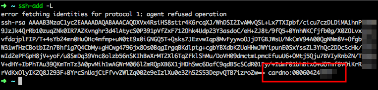

<!--  -->

Yaklaşık 2 hafta önce [Yubikey nedir, ne değildir]() kısaca bahsetmiştim. Bugünkü yazımda da Yubikey’i bir smart card olarak kullanıp OpenPGP anahtarlarını barındırmak için OSX, Windows ve Linux üzerinde yapılması gerekenleri anlatacağım.

> Bu yazının sonunda güvenli bir GPG anahtarı zinciriniz olacak, ve de bu anahtarları SSH key olarak kullanıp GPG/SSH Key’leri bilgisayarınızda değil Yubikey’inizde tutarak sunucularınıza Yubikey ile kimlik doğrulaması yapabilecek ve de bağlanabileceksiniz.

İlk olarak Yubikey’inizin GPG anahtarları desteklediğini, ve de maksimum kaç bit RSA’ya kadar desteklediğini öğrenmelisiniz. Sadece Yubikey Neo ve Yubikey 4 modelleri GPG anahtarı destekliyor. Yubikey 4 sahibiyseniz 4096, Neo sahibiyseniz 2048 bit’e kadar GPG anahtarı oluşturabiliyorsunuz.


Bende Yubikey 4 olduğu için ben 4096 bit’i tercih ettim. Yubikey Neo’da bu değer 2048 bit.

Öncelikle bir GPG anahtarı çifti (public / private key) oluşturmalısınız, ve de bu anahtarın alt anahtarlarını (sub keys) hazırlamalısınız. Bu alt anahtarları doğrulama için kullanacağız, ve de master key’i güvenli, çevrimdışı bir yerde saklayacağız. Bunun için [şu linkteki](https://alexcabal.com/creating-the-perfect-gpg-keypair/) ([Reddit konusu](https://www.reddit.com/r/netsec/comments/1mhvq5/creating_the_perfect_gpg_keypair), [olur da kapanırsa diye archive.org yedeği](https://web.archive.org/web/20160329154904/https://alexcabal.com/creating-the-perfect-gpg-keypair/)) makaleyi önerebilirim.

Ben GPG anahtarı oluşturmanız için ideal koşulları sağlamanızı, bunun için de bir Linux Live CD dağıtımı açıp, içine gnupg ve gnupg2 uygulamalarını yüklemenizi tavsiye ederim. Ben Ubuntu’yu Mac OS X’te bir araç ile live olarak boot edip içerisinde anahtarımı oluşturdum. Anahtar bit derinliği olarak da kullanabildiğiniz en yüksek derinliği kullanın. Ben 4096 bit’te oluşturdum.

Linux dağıtımımda anahtarları oluştururken entropi yapmak için rastgele işlemler yapmamı istedi uygulama (mouse hareketi, tuşlara basma, işlemler vs.) . Ne yaptıysam 4096 bit şifreleme için gerekli entropiyi oluşturamadım. En sonunda çözümü halihazırda Live CD’de yüklü olan LibreOffice’i kaldırarak gerçekleştirdim.

> Bu aşamaların sonunda elimde, Yubikey’ime yüklenmeye hazır, an itibari ile GPG keychain’imde olan “Laptop Key” anahtarlarım, ve de çevrimdışı olarak yedeklediğim master key’im vardı.

#### Şimdi bu anahtarları Yubikey’e yüklemem lazım.

Bunu da çok basit yollarla çözdüm.

Keychain’imde yüklü olan public key’i gpg2 aracı ile düzenleme menüsüne bastım. Ardından “toggle” diyerek public key’lerden secret key’lerin listelenmesine geçtim. Ardından bir önceki yazımda da değindiğim gibi “key 1”(diğer anahtarlar için key 2, key 3 vs.), ve ardından “keytocard” diyerek sırayla **S**ign Key (imzalama anahtarı), **E**ncryption key (şifreleme anahtarı) ve **A**uthentication key (kimlik doğrulama anahtarları)nı Yubikey’e yükledim.

```bash
$ gpg2 --edit-key 07D1E784D2ED9B73
gpg (GnuPG/MacGPG2) 2.0.26; Copyright (C) 2013 Free Software Foundation, Inc.
This is free software: you are free to change and redistribute it.
There is NO WARRANTY, to the extent permitted by law.
Secret key is available.
pub 4096R/0x07D1E784D2ED9B73 created: 2015–03–06 expires: 2017–03–05 usage: C
trust: ultimate validity: ultimate
sub 4096R/0xAED9256FF8CEC558 created: 2015–03–06 expires: 2025–03–05 usage: A
[ultimate] (1). john doe <johndoe@localhost>
gpg> toggle
sec 4096R/0x07D1E784D2ED9B73 created: 2015–03–06 expires: 2025–03–05
ssb 4096R/0xAED9256FF8CEC558 created: 2015–03–06 expires: never
(1) john doe <johndoe@localhost>
gpg> key 1
sec 4096R/0x07D1E784D2ED9B73 created: 2015–03–06 expires: 2017–03–05
ssb* 4096R/0xAED9256FF8CEC558 created: 2015–03–06 expires: never
(1) john doe <johndoe@localhost>
gpg> keytocard
Signature key ….: [none]
Encryption key….: [none]
Authentication key: [none]
Please select where to store the key:
(3) Authentication key
Your selection? 3
You need a passphrase to unlock the secret key for
user: "john doe <johndoe@localhost>"
2048-bit RSA key, ID 0xAED9256FF8CEC558, created 2015–03–06
sec 4096R/0x07D1E784D2ED9B73 created: 2015–03–06 expires: 2017–03–05
ssb* 4096R/0xAED9256FF8CEC558 created: 2015–03–06 expires: never
card-no: 0006 03366476
(1) john doe <johndoe@localhost>
gpg> save
```

Bunun ardından “save” yazarak karta yüklemeyi tamamaladım.

Bu durumda

```bash
gpg2 --card-status
```


Komutuyla karttaki anahtarların durumunu kontrol edebilirsiniz:


Bunun ardından GPG anahtarlarımı (“Laptop Key”), linklediğim makaledeki gibi yedeklediğimden emin olup, geçici olarak yükediğim bilgisayardan sildim.

Artık Yubikey’ime yüklediğim GPG anahtarlarımı bilgisayarlarımda kullanmaya hazırdım.

### GPG anahtarlarını bilgisayarda kullanmak

Sıra ile OSX / Linux ve de Windows için anlatacağım bu yollar ile Windows, Linux ve Mac OSX üzerinde Yubikey’i GPG agent olarak kullanabilecek, ayrıca SSH Bağlantılarınızı bağlandığınız sunucunuza ekstra bir şey yüklemeden Yubikey’deki GPG anahtarları ile yapabileceksiniz.

#### Linux ve OSX

Öncelikle gpg-agent’ı indirmelisiniz. Mac OSX’te [homebrew](https://brew.sh) ile kurduğum gnupg ve gnupg2 ile gpg-agent bağımlılık olarak geliyor. Linux distrolarında da yüklü gelmeli. Mac OSX’te alternatif olarak [GPG Suite](https://gpgtools.org)’i de kullanabilirsiniz. Eğer e-posta gönderimleri için de kullanacaksanız GPGTools’un az önce linklediğim GPG Suite adlı programı kurmanızı öneririm. Mail.app, Thunderbird gibi uygulamalara otomaik olarak entegre oluyor. Benim henüz böyle bir ihtiyacım olmadığından olabildiğince az paket kurarak gerçekleştirmek istedim.

Kurulumun ardından önce klasörlerin oluştuğundan emin olmak için `gpg-agent`’ı çalıştırıp durduruyoruz:

```bash
gpg-agent && killall gpg-agent
```


Bunun arkasından Yubikey’in pin numarasını girmek için [pinentry](https://www.gnupg.org/related_software/pinentry/index.en.html) adlı uygulamayı kurmalıyız. Bu araç Mac OS X’te Homebrew ile yüklenen gnupg ve gnupg2 yanında bağımlılık olarak geliyor. Eğer yüklü değilse Homebrew’dan veya Linux dağıtımınızda paket yöneticisinden kolaylıkla kurabilirsiniz.

Şimdi de kendi $HOME klasörünüz altında .gnupg klasörü, ve de içinde gpg.conf ve benzeri dosyalar olacak. Biz `~/.gnupg/gpg-agent.conf` dosyasını düzenleyeceğiz (ve yoksa oluşturacağız). Dilediğiniz editörle bu dosyayı açıp düzenleyebilirsiniz. Ben [atom](https://atom.io) kullandım.

```bash
atom ~/.gnupg/gpg-agent.conf
```


İçini aşağıdaki gibi doldurun:

```bash
# if on Mac OS X and GPG Suite is installed
# otherwise, look for `pinentry' on your system
# Bende pinentry Mac OSX Homebrew ile direkt yüklü olduğu için alt satırı yorum haline döndürdüm. Eğer GPGSuite programı ile GPG2'yi kurduysanız aşağıdaki gibi yolunu belirtmeniz gerekiyor
# pinentry-program /usr/local/MacGPG2/libexec/pinentry-mac.app/Contents/MacOS/pinentry-mac
# SSH Desteği için.
# Bu parametre sayesinde GPG anahtarı SSH anahtarı gibi kullanılabilecek
# enables SSH support (ssh-agent)
enable-ssh-support

# Ortamı dosyada saklamak için Bu sayede soket tarzında kullanımla devamlılık sağlanacak.
# writes environment information to ~/.gpg-agent-info
write-env-file
use-standard-socket
# Anahtar Cache sürelerini daha verimli bir kullanım için uzatıyoruz
# default cache timeout of 600 seconds
default-cache-ttl 600
max-cache-ttl 7200
```

Şimdi de kullandığım ortama göre ($SHELL, bash veya zsh olabilir, genelde özellikle kurmadıysanız bash’tır) `~/.bashrc` veya `~/.zshrc` dosyamın içine şu değerleri ekledim:

```bash
# yubikey için
if [ -f "${HOME}/.gpg-agent-info" ]; then
 . "${HOME}/.gpg-agent-info"
 export GPG_AGENT_INFO
 export SSH_AUTH_SOCK
 export SSH_AGENT_PID
fi
export GPG_TTY=$(tty)
# yubikey için son
```

Ardından `gpg-agent`’ı yeniden başlatmamız lazım:

```bash
killall gpg-agent   
eval $(gpg-agent --daemon --enable-ssh-support)
```

Ben bu işlemler için terminal ortamımda bazı kısayollar hazırladım. Eğer göremezsem `gpgkill`, ardından `gpgrun` deyip yeni sekme açıp doğrudan görebiliyorum. Belki işinize yarar diye buraya de eklemek istedim:

```bash
alias gpgkill="killall gpg-agent"  
alias gpgrun="eval $(gpg-agent --daemon --enable-ssh-support)"  
# alias gpgfix="gpgkill && gpgrun echo 'simdi yeni pencere acin'"
```
Yorum haline getirdiğim `gpgfix` de belki işinizi görebilir.

Bundan sonra yeni bir terminal sekmesi açıp, ssh key listeleme yaptığınızda public SSH Key’inizi görüyorsanız işlemleri başarı ile gerçekleştirdiniz demektir:



Resimde de gördüğünüz gibi, çıkan SSH public key, aslında GPG Authenticator anahtarımın SSH key’e dönüştürülmüş hali :)

Artık bu SSH Key’i sunucunuza yükleyip tanımladıktan sonra SSH key ile giriş denerken smart card’ızın pini (dikkat, GPG anahtar şifresi değil!) sorulacak, ve de doğru girişiniz ardından terminal’e düşeceksiniz.


Grafik arayüzlü pinentry metodu da var (gpg-agent.conf’taki örnekteki gibi), ama terminal üzerindeki bu yol bana yettiği için pek karıştırmak istemedim.

Burada doğru metodla (ssh key) giriş yaptığınızı ssh komutunuza -v (verbose) mode diyerek de takip edip doğrulayabilirsiniz.

#### Windows İçin

Windows için öncelikle [Gpg4Win](https://www.gpg4win.org/) adlı uygulamayı indirmeliyiz. Bu uygulama Windows ortamında GPG paketlerini kurup, imzalı ve kriptolanmış e-posta göndermenizi ve de akıllı kartınızı yönetmenizi sağlayan araçları barındırıyor.

Bu paketin full halini indirmelisiniz. Bu paket, size gnupg yanında kripto e-posta gönderen araçları, pin girişi için pinentry uygulamasını, ve de akıllı kartınızı düzenlemek için gui programlarını barındırıyor.

Kurulum ardından uygulama bağlı olan kartınızı algılayacak, ve de yüklenen programlar ile doğrudan GPG anahtarlarınızı kullanmaya başlayacaksınız.

Eğer benim gibi SSH bağlantısı için, veya terminallerinizde kullanacaksanız yapmanız gereken birkaç aşama daha var.

Şimdi kurulan uygulamalardan Kleopatra’yı açıp “Settings > Configure Kleopatra” menüsüne tıklayın. Açılan menüden en alttakiGnuPG Sysyem menüsüne tıklayıp açılan sekmeli menüden “GPG Agent” menüsüne tıklayın. Burada “enable putty support” diye bir seçenek var. Ona tıklamalısınız.


Ardından “Ok” diyip ayarları kaydedin.

Şimdi de SSH bağlantısı için “Putty” i açın. SSH key ve portunu girerek bağlanmayı deneyin. Her şey sorunsuz olursa akıllı kartınız için pinentry arayüzü gelecek ve de size şifre soracak:


Burada bazen anahtarı çıkartınca bağlanamama sorunu yaşayabiliyorsunuz. Bunun için internette bir bat dosyası buldum. Bu dosyadaki komutlar `gpg-agent`’ı kapatıp yeniden başlatıyor, ve de Putty’nin algılaması için Kleopatra uygulamasını yeniden çalıştırıyor.

Bunun önüne geçmek için aşağıdaki kodları `.bat` uzantısıyla bir yere kaydetmeniz yeterli.

```bash
taskkill /f /im kleopatra.exe
taskkill /f /im gpg-agent.exe
taskkill /f /im scdaemon.exe
"C:\Program Files (x86)\GNU\GnuPG\kleopatra.exe"
```

Bu komutları çalıştırdıktan sonra kleopatra yeniden açılacak ve de GPG anahtarı ile bağlanamama sorununuz çözülecek, ve de sunucunuza başarı ile bağlanacaksınız.

Burada (en azından benim için) tek bir sorun kalmıştı:

> **_Putty’i çok kullanışsız buluyorum ve de kullanmayı hiç sevmiyorum!_**

Senelerdir Linux ve de OS X kullanan biri olarak Putty hem arayüz hem de karşı sunucuya bağlantıktan sonra verdiği deneyim olarak bana oldukça zayıf geliyor. Bu nedenle ben de Windows ortamında [Babun](http://babun.github.io/) ismindeki Cygwin paketini kullanıyorum. Buradaki tek sorunum Cygwin/Babun ile Kleopatradaki bu ayarın Putty ile konuştuğu gibi konuşamamasıydı, bu nedenle de Cygwin kurulumlarının GPG akıllı kartındaki SSH key’leri göremiyordu.

Bunun için Putty’nin GPG doğrulamasını Cygwin’e köprüleyecek bir ara köprü lazımdı. Kısa bir araştırma sonucu [ssh-pageant](https://github.com/cuviper/ssh-pageant) adlı paketin tam bu iş için hazırlanmış olduğunu gördüm. Teoride bunu Cygwin ortamıma kurunca Kleopatra üzerinden sunulan GPG bilgisini Cygwin ortamımda kullanabilecektim.

Repo linkinde kurulum makaleleri mevcut, ayrıca benim gibi Windows’ta Babun kullanıyorsanız şanslısınız. Babun’da dahili olarak gelen [pact](http://babun.github.io/#_package_manager) adlı paket yönetimi ile pageant’ı kolaylıkla kurabilirsiniz. Babun’u açıp aşağıdaki komutu çalıştırmanız yeterli:

```bash
pact install ssh-pageant
```

Ve de `.zshrc`, veya `.bashrc` vs. dosyanızda şunun gibi bir satırın olduğundan emin olun (paket kurulumu ardından kendi oluşturmalı):

```bash
eval $(/usr/bin/ssh-pageant -r -a "/tmp/.ssh-pageant-$USERNAME")
```

Bunun ardından Cygwin üzerinde GPG anahtarınızı SSH doğrulamasında kullanabileceksiniz:


**Tebrikler, artık OS X, Linux ve de Windows’ta Yubikey ve de benzeri cihazlarınıza yüklü GPG anahtarlarını başarı ile kullanabilir ve de kimlik doğrulaması yapabilirsiniz!**