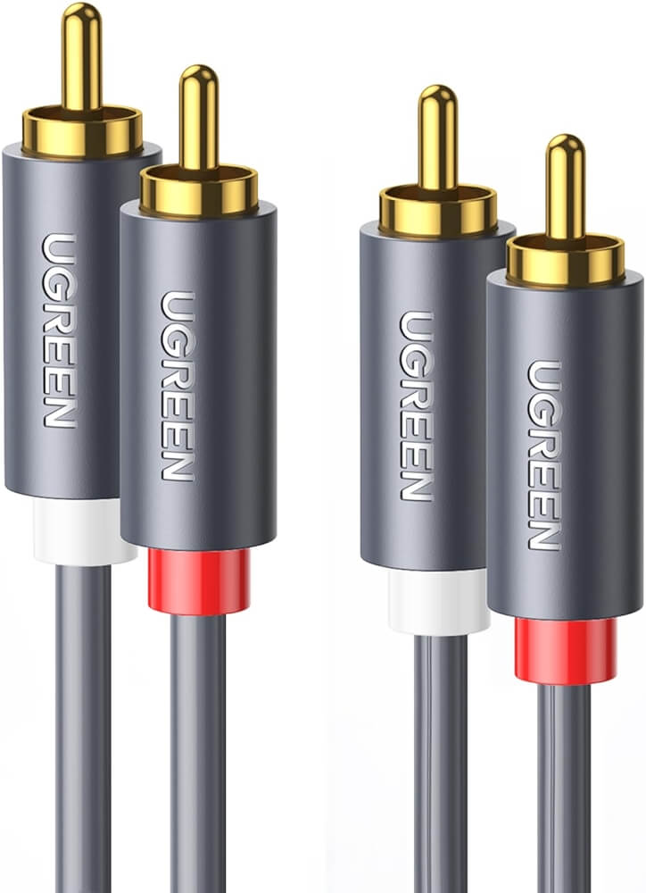
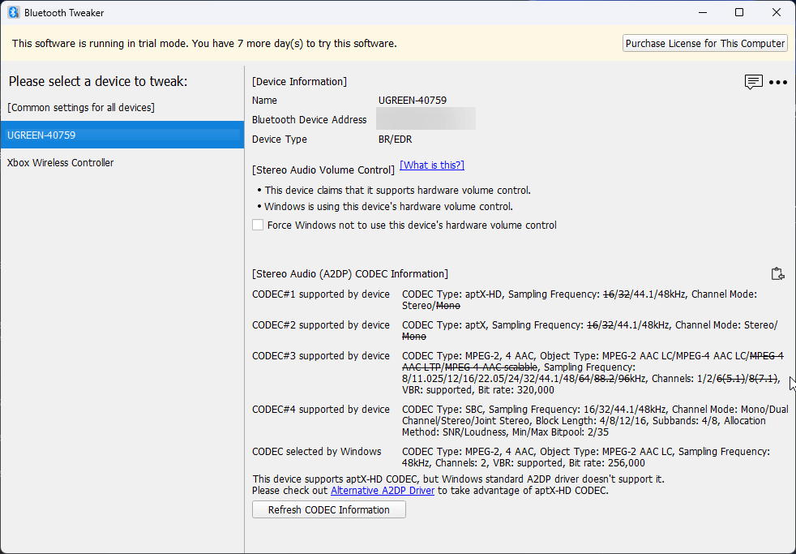
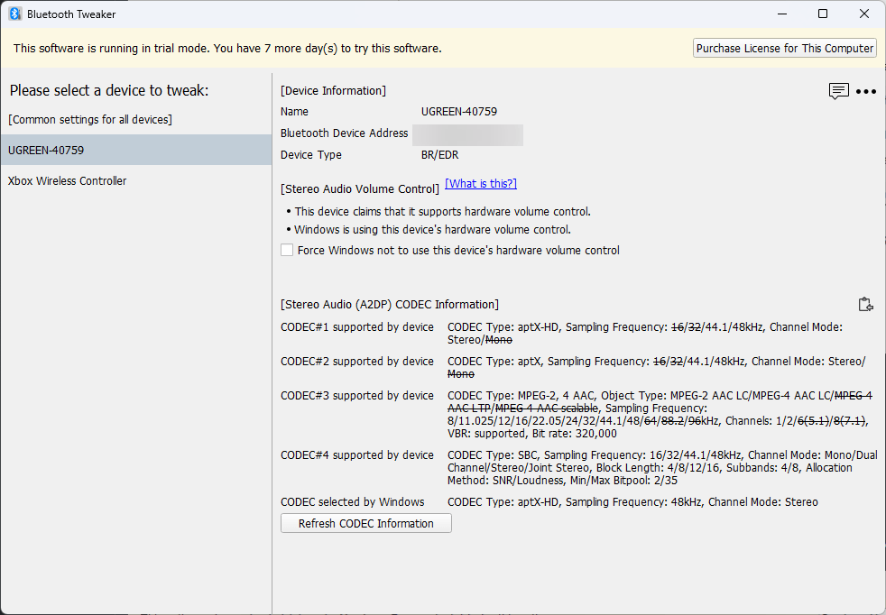
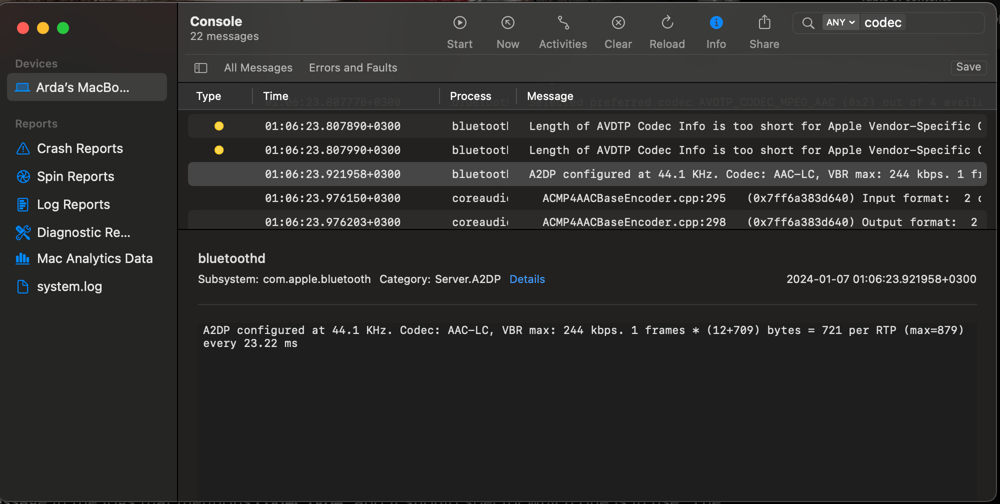

Recently I bought [this bluetooth receiver](https://www.aliexpress.com/item/32777804376.html) to utilize my old Logitech z506 speakers on my macBook. The testing of the device, purely due to laziness at Windows, led me to write this blog post 😅

The reason that I chose is that it has a good feedback overall, it is easly accessible, is rather cheap, and Ugreen is a brand that I trust and like overall. I've never had a bad product from Ugreen.

It has two RCA ports, in addition to a headphone jack. You could use either outputs, or both.

I also got a dual RCA cable, also branded as Ugreen.

The installation was quite easy. I plugged the RCA ends to my speaker's second input, and the other ends to the receiver. The receiver needed a 5v power supply, so I hooked a micro usb cable from my Intel Nuc, which was right next to the receiver.

To test, before using macOS, I tried Windows, and it all went smoothly. The basses were decent, also the trebles and mids. I was happy with the device.

However, I had a slight annoying issue with the delay. It was like 80 ms (I roughly tested with [this video](https://www.youtube.com/watch?v=ucZl6vQ_8Uo). I compared the wired and wireless and roughly calculated delay. Right after I heard the ball touching I paused the video and get the center of the line to get the average delay). Although it's quite a good value, and the store page told me the delay was about 200ms, I knew it was depending on the codec both at source and target. I also knew APTX and APX HD devices should have like 80ms and 40ms delays average respectfully.

So I thought the device was not being utilized as APTX HD, but just APT, depending on the delay.

Also, the feedback photos showed APTX HD was utilixed on their devices, so I thought I am missing something essential.

To prove my theory, I needed to understand which coded was being utilized on Windows.

I checked some forums and Reddit, and I stumbled upon this tool called [Bluetooth Tweaker](https://www.bluetoothgoodies.com/tweaker/). It has various tiny yet useful features. For me, the bluetooth codec information was the required feature.

When I checked it, realized my thoughts were correct. APTX was utilized, but not APTX HD.

By the way, this is Windows 11 Pro, with all updates installed.

As you can see, there's a info below, mentioning me that using the [Alterantive A2DP Drivers](https://www.bluetoothgoodies.com/a2dp/), I could overcome this issue!

So I downloaded and installed the driver, then replaced the default one with this.

...and voila! The initial response of the device is even faster, and the delays are even lower (about 40ms, unlike 80ms), and APTX HD was enabled, along with bigger bandwidth!

The tool was like $5 and the driver was like $8, so bought them both instantly!

I'm so far happy with the outcome.

## Bonus: How to check the audio coded of bluetooth on macOS:

Since I'm checking it right now, I wanted to share it as well. 

* Open the console.app from Applications/utilities
* Write codec on the search bar, and press enter
* Then press start on the menu
* Now, connect your bluetooth device and pair it
* You'll see bunch of outputs like this:

* From this message, you can understand which codec is utilized for the device, at the time being.

Mine is something like this, on my chunky 2020 Intel macBook:

> A2DP configured at 44.1 KHz. Codec: AAC-LC, VBR max: 244 kbps. 1 frames * (12+709) bytes = 721 per RTP (max=879) every 23.22 ms