A couple of months ago, my old speaker set, [Logitech Z506](https://www.amazon.com/dp/B003VAK1FA), started to act funny.

Its volume was shifting randomly, from low to very high, then back to low. I was almost getting crazy why this was happening, and [I tried to fix it](https://x.com/ardadev/status/1808595374908789200/) by changing the potentiometer, reflowing the capacitors, but no luck. It was gone, now possibly in a recycling area.

At that point, I decided to upgrade my sound gear and fully embrace HiFi music for a more immersive listening experience.

I bought some gear to listen to HiFi music both on the go and from my desktop. Got myself:

* An external sound card: [Focusrite Scarlet Solo (Gen 4th)](https://focusrite.com/products/scarlett-solo)
* External Monitor: [PreSonus Eris E3.5](https://intl.presonus.com/products/eris-e35-studio-monitor)
* Studio Headphones: [Beyerdynamic DT 770 Pro, 250 Ohms](https://global.beyerdynamic.com/p/dt-770-pro)
* Some custom Cables for Balanced Output: First [Behringer GIC-90 4SR](https://www.behringer.com/product.html?modelCode=0013-AAP), then switched to some custom made cables from GuerGuo, [here](https://www.aliexpress.com/item/1005006465852662.html)

And for mobile, got these:

* IEMs: [KZ Saga](https://kz-audio.com/kz-saga.html), Bass Improved Version, since the difference between the bass improved and harman target was too low I wanted to go for it.
* DAC for USB-C: [Fiio Ka11](https://www.jadeaudio.com/XC2?product_id=71&_l=en)
* DAC for Lightning (and USB-C): Apple Dongle: [USB-C](https://www.apple.com/shop/product/MW2Q3AM/A/) and [Lightning](https://www.apple.com/shop/product/MMX62ZM/A/)
* Another DAC for Lightning: Jcally JM6 Pro

With these equipments, I could really feel the difference between the Spotify's High Quality setting and my Bandcamp purchases, especially with the basses and trebles so I wanted to go fully for the HiFi experience.

At first, I tried Tidal from overseas through my friend, but he couldn't provide me access, so I got Apple Music instead.

Why I Chose Apple Music for HiFi:

* It was made by the company who's made Logic Pro X and iPod, so they should have known some things about sound
* It has HiFi support
* Apple Music not only supports HiFi music playback but also stands out as a great choice for audiophiles seeking cross-platform compatibility.
* It's actually more affordable than Spotify in my country
* Their catalogue is already satisfactory for me, who mostly listens to metal music and blues

So I decided to jump in.

My very first impressions after listening to [Tool - 1000 days](https://music.apple.com/us/album/10-000-days/1474250650) album from Apple Music with my new headphones was "woah!". I felt I definitely did the right thing by upgrading.

However, there were some obstacles that I had to take care of:

* Last.fm scrobbling is a must for me, through all platforms I use (macOS, iOS, iPadOS, Windows). This also feeds my [maloja](https://github.com/krateng/maloja) profile [instance](https://music.arda.pw).
* I had to import my playlists from Spotify
* I had to find a way to play last.fm radios
* I had to use free and open-sourced solutions as much as I can
* I don't want to use 3rd party listening clients such as [Marvis Pro](https://apps.apple.com/us/app/marvis-pro/id1447768809)

In this blog post, I'll try to describe how I achieved these all, with the tools I utilized.

## How to Enable Last.fm Scrobbling Across Platforms

This is a huge issue, and I had to find solutions for every platform that I use. I tried to use free and open-sourced apps as much as I could, while not utilizing 3rd party player clients.

### macOS

For macOS scrobbling, I'm utilizing [Scrobbles for last.fm](https://apps.apple.com/app/scrobbles-for-last-fm/id1344679160).

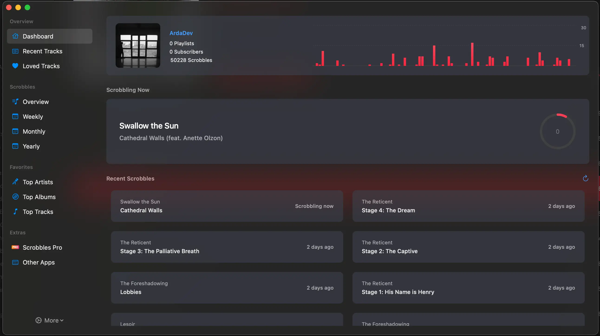

For those looking to scrobble their HiFi music seamlessly, the free app integrates with last.fm to track your listening habits across Apple Music. It also has a tiny menu item. You simply set it and forget it.

### Windows

For scrobbling on Windows, I'm using an open-source app called [AMWin-RP](https://github.com/PKBeam/AMWin-RP) (Apple Music Windows Rich Presence).

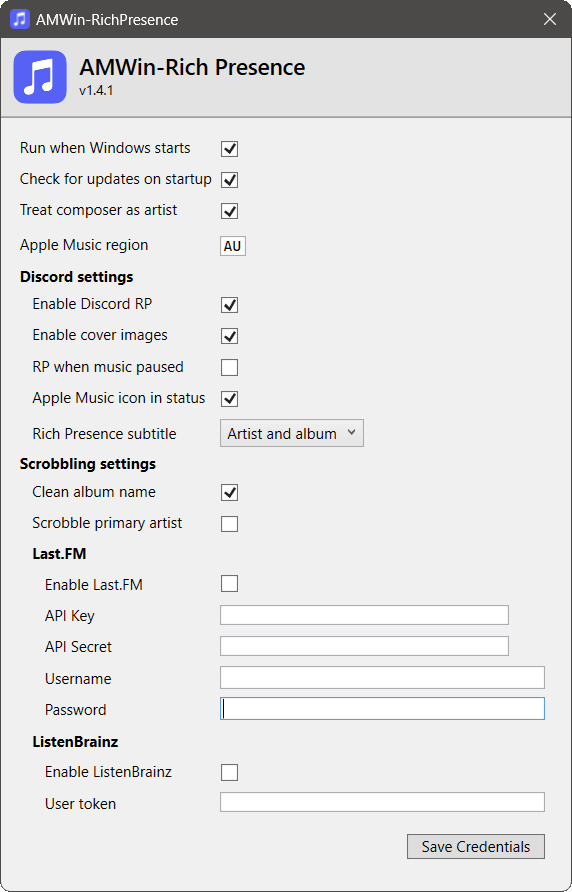

This tool both supports last.fm scrobblind, and publishes your music presence status on Discord. I'm just using the last.fm part without issues.

You simply provide an API key [here](https://www.last.fm/api/account/create), and provide your credentials afterwards. After that, you can see your "now playing" status populated on your last.fm account.

### iOS / iPadOS

I'm using [QuietScrob](https://apps.apple.com/app/quietscrob-last-fm-scrobbler/id741599377) for this.

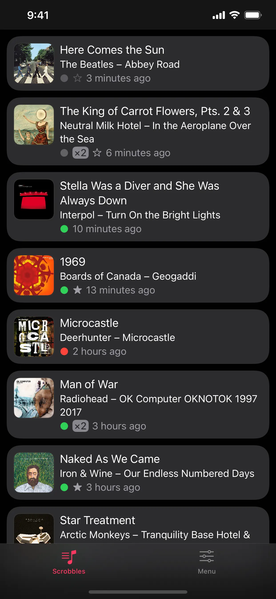

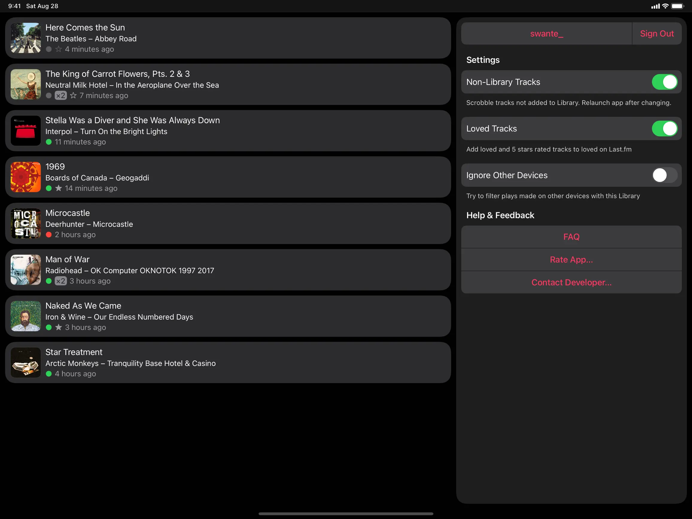

For this as well, you need to allow library access and login to your last.fm account.

The caveat is that quietscrob needs to be stayed open in the background, this may cause more battery consumption.

The alternative is [the official last.fm app](https://apps.apple.com/us/app/last-fm/id1188681944), but it catches the scrobbles and then "uploads" to last.fm. If you play your songs offline most of the time, it may be worth checking this, however I used to do this back in 2005 with my iPod 5th gen.

## Importing Playlists

I had a ton of playlists over the years at Spotify. Some of these are common playlists with my friends, some of them are my very own playlists, and some of them are Spotify's official playlists that I follow.

To import these to Apple music, I am using an app called [Playlisty](https://www.obdura.com/playlisty/). You can find it in the [App Store](https://apps.apple.com/us/app/playlisty/id1459275972).

It's a nice app that imports your playlists from various sources to Apple Music.

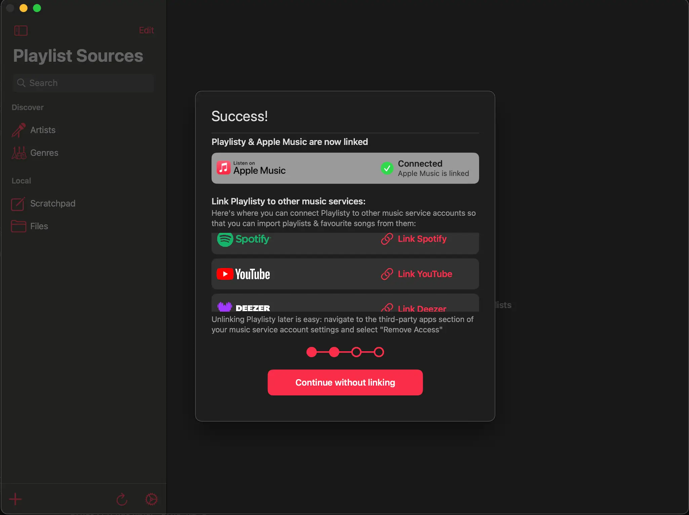

1. You simply login with your source accounts, and it fetches your playlists automatically:

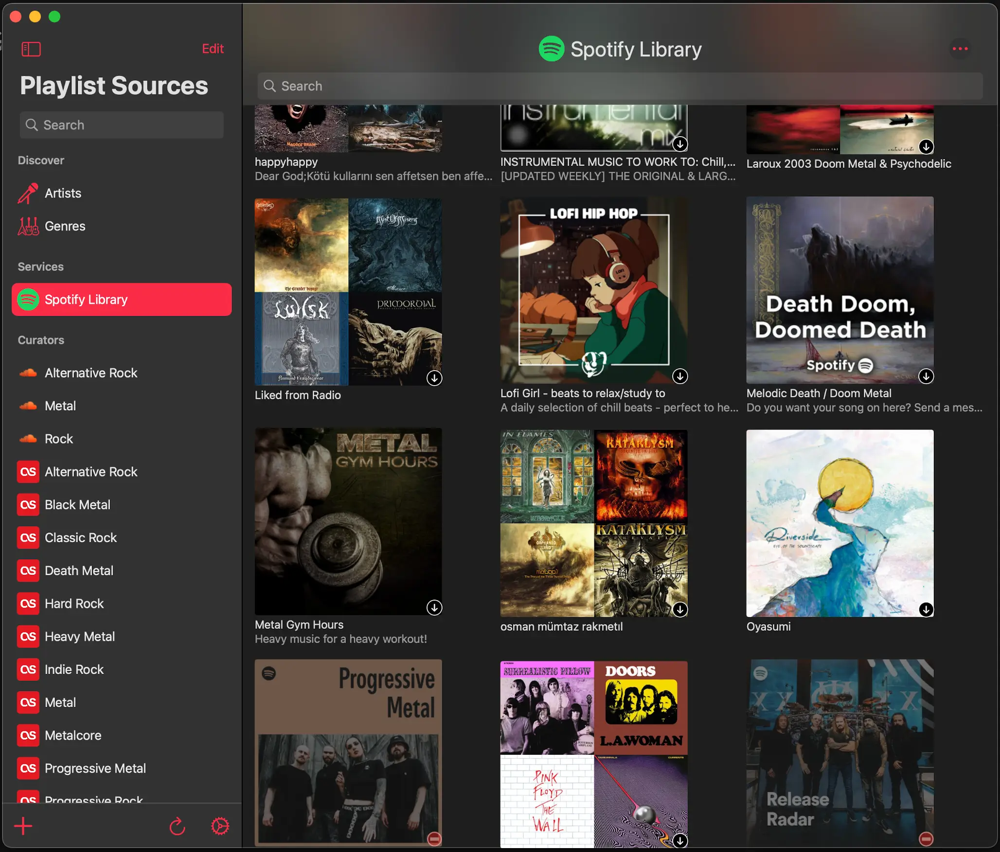

2. When you click on a playlist, you'll see the real magic. It tries its best to match the songs from your source to Apple Music, by checking label id, global databases, and name matching.

I believe this is the place where the app really shines!

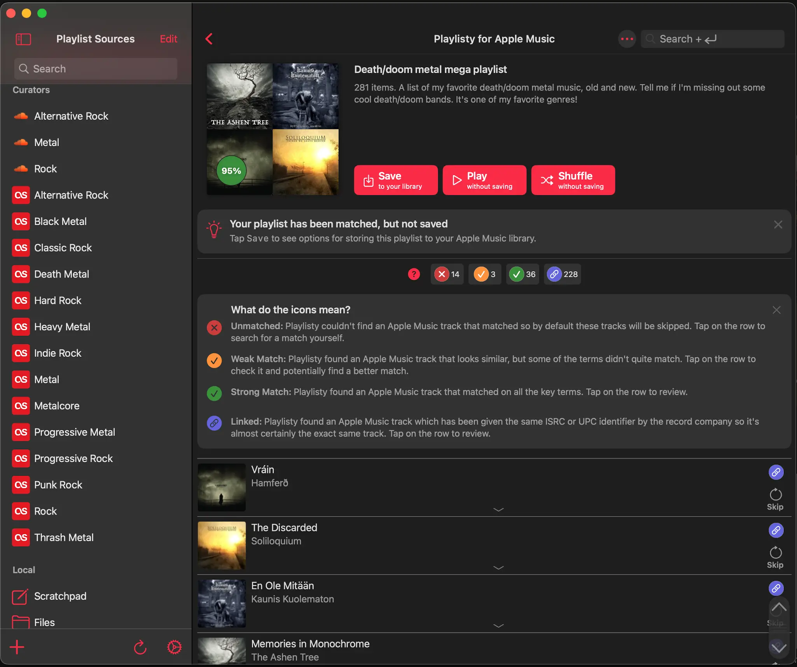

3. You simply click "Save in your library", then it'll pop up in your Apple Music account's Playlists section.

## Listening to Last.fm radios

I Love last.fm! I still find their discover feature the best overall (I yet have to experience Apple Music a little more, but Spotify's algorithm was crap comparing to last.fm). I had to find a way for this. Back then, when I was actively using Spotify, I needed this so much I had created a tool called [Recommendify](https://github.com/Ardakilic/recommendify). Gladly, now you can do this directly via last.fm, but with a twist.

1. First, we need to create a new playlist for our radio from last.fm. It's like instead of listening to "my recommendations" you create a playlist with songs filled with "my recommendations".

Go to your last.fm profile, then to your playlists section:

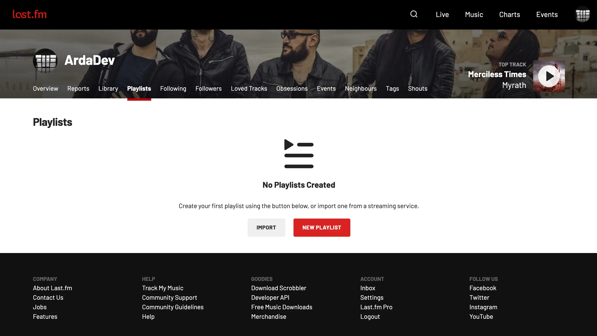

2. Then, create a new playlist

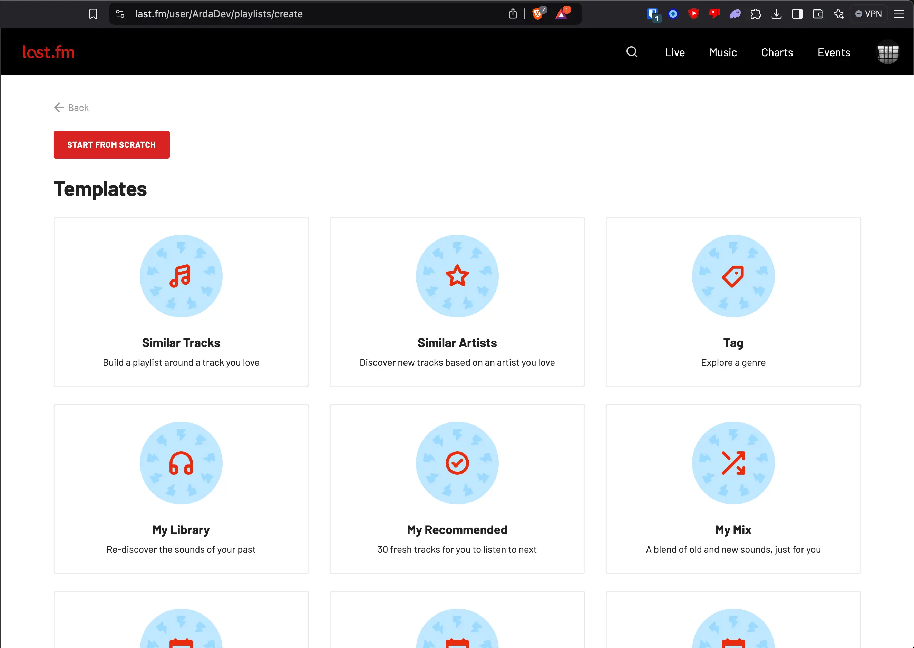

I'm clicking "My Recommended" here, because it's where I like to listen most.

3. Then, from there, if you click, it'll create a new draft of a playlist with 30 songs populated already:

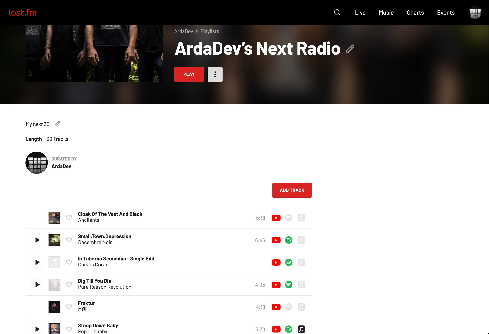

You can click to "load similar tracks" to populate more songs (bigger playlist, so just like a longer radio session):

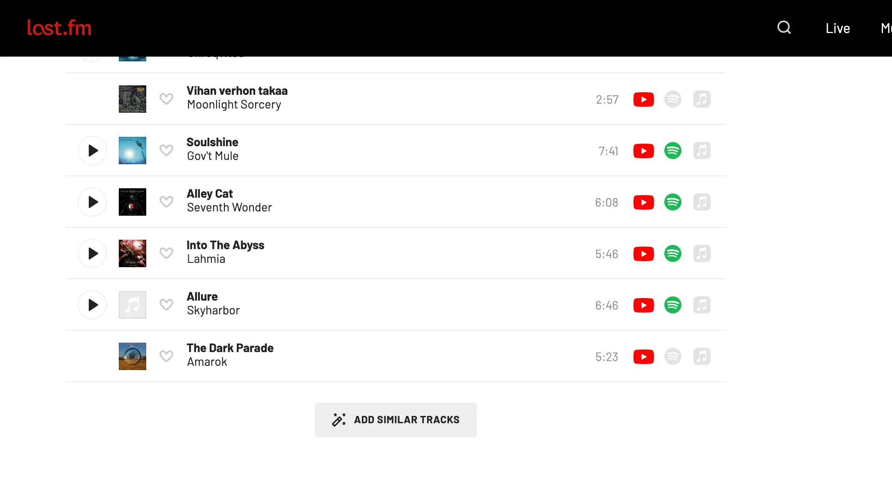

4. Then you need to export the playlist to a music source:

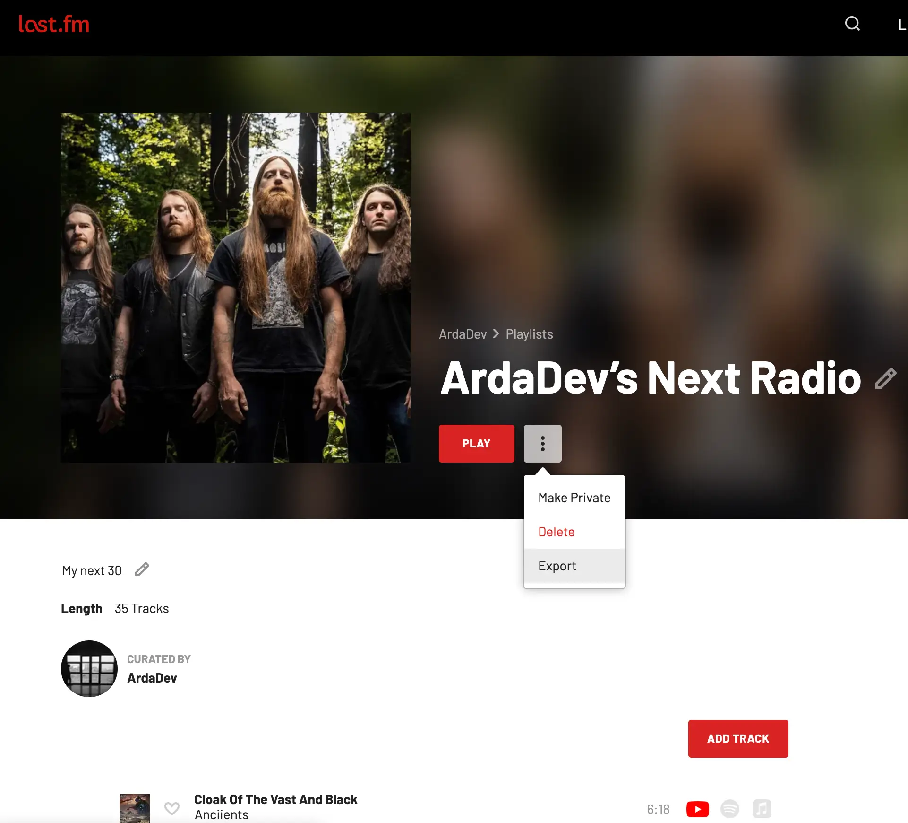

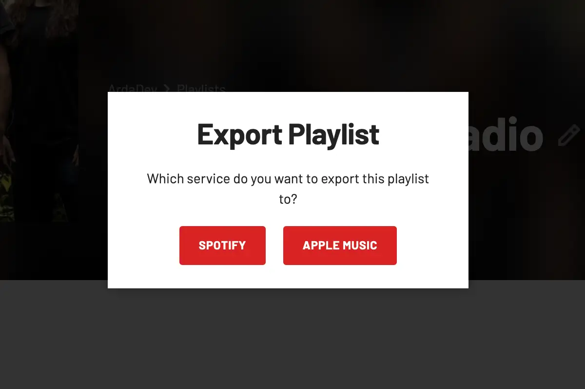

5. **Do not click to export to Apple Music** here. Notice from my earlier screenshots, there are 3 icons next to each song? First one is Youtube Music, second one is Spotify, and the third black one is Apple Music. In my playlist, almost none of the songs matched to Apple Music (they are grayed out), so directly exporting will import almost none of the tracks. That's why we'll export this playlist to Spotify instead (see where I'm going?). After that, we'll have to [import this playlist](#importing-playlists) to Apple Music.

The importer app, Playlisty helps us match the songs here, so it's essential. I sugggest making large radio/playlists so you don't have to do this again and again.

This is a finicky way, but I could not find a better way to listen to last.fm radios directly.

Thanks for reading! If you're an audiophile or HiFi music enthusiast exploring Apple Music, I hope this post helps you make the most of your setup.

Have you tried upgrading your sound setup? What are your favorite tools for HiFi and playlist management? Let me know in the comments!