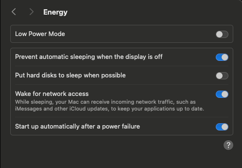

# Setting Up a Mac Mini as a Persistent Web Server

When setting up a Mac Mini as a web server, ensuring it remains operational even after power outages and without requiring user login is essential. This post documents my configuration for a reliable, always-on Mac Mini server.

## Power Management Settings

First, I configured the power management settings to ensure the Mac Mini stays operational:

- **Disabled Low Power Mode**: Ensures the system runs at full performance
- **Prevented automatic sleeping when display is off**: Critical for headless server operation
- **Disabled putting hard disks to sleep**: Prevents disk access delays
- **Enabled wake for network access**: Allows the Mac to respond to network requests even when sleeping
- **Configured automatic startup after power failure**: Ensures the server restarts without manual intervention if power is lost

These settings can be found in System Settings → Energy.



## Auto-Mounting Drives on Boot

By default, macOS only mounts external drives when a user logs in. For a persistent server, we need drives to mount automatically at boot time, regardless of login status.

To enable this feature, I ran the following command:

```bash
sudo defaults write /Library/Preferences/SystemConfiguration/autodiskmount AutomountDisksWithoutUserLogin -bool true
```

Alternatively, you can create the file `/Library/Preferences/SystemConfiguration/autodiskmount.plist` with the following content:

```xml
<xml version="1.0" encoding="UTF-8"?>
<!DOCTYPE plist PUBLIC "-//Apple Computer//DTD PLIST 1.0//EN" "http://www.apple.com/DTDs/PropertyList-1.0.dtd">
<plist version="1.0">
    <dict>
        <key>AutomountDisksWithoutUserLogin</key>
        <true/>
    </dict>
</plist>
```

I got the plist file from [here](https://gist.github.com/jabenninghoff/f13f81c286e914c48942f973f5d15819) ([archive.org backup](https://web.archive.org/web/20250407200815/https://gist.github.com/jabenninghoff/f13f81c286e914c48942f973f5d15819)).

This ensures any external drives containing website files or databases will be available immediately after boot, without requiring login.

## Further Improvements for a Robust Web Server

While the above configuration provides a good foundation, here are additional enhancements to make your Mac Mini web server even more robust:

### 1. Launch Agents and Daemons for Your Web Services

Create launch agents or daemons to start your web server and related services automatically:

1. Create a file in `/Library/LaunchDaemons/` (for system-wide services that run at boot) or `/Library/LaunchAgents/` (for user services that run at login)
2. Use the appropriate naming convention (e.g., `com.yourusername.webserver.plist`)

### 2. Setting Up Orbstack and Docker to Run on Boot

I'm using Orbstack instead of Docker desktop for its efficiency and performance. The following steps will include howtos for Orbstack.

1. **Create a Launch Daemon for Orbstack**:

A Launch Daemon will run at system boot time, regardless of whether any user logs in. This is exactly what we want for a headless server setup:

```bash
sudo nano /Library/LaunchDaemons/com.yourname.orbstack.plist
```

Add the following content:

```xml
<?xml version="1.0" encoding="UTF-8"?>
<!DOCTYPE plist PUBLIC "-//Apple//DTD PLIST 1.0//EN" "http://www.apple.com/DTDs/PropertyList-1.0.dtd">
<plist version="1.0">
<dict>
    <key>Label</key>
    <string>com.yourname.orbstack</string>
    <key>RunAtLoad</key>
    <true/>
    <key>KeepAlive</key>
    <true/>
    <key>UserName</key>
    <string>yourusername</string>
    <key>ProgramArguments</key>
    <array>
        <string>/Applications/OrbStack.app/Contents/MacOS/OrbStack</string>
        <string>--background</string>
    </array>
</dict>
</plist>
```

Replace `yourusername` with your actual macOS username. The UserName key specifies which user's context to run the process in, without requiring that user to be logged in.

2. **Set proper permissions for the plist file**:

```bash
sudo chown root:wheel /Library/LaunchDaemons/com.yourname.orbstack.plist
sudo chmod 644 /Library/LaunchDaemons/com.yourname.orbstack.plist
```

3. **Create a script to start Docker containers** (optional):

If you prefer manual container management over Docker Compose, you can create a startup script:

```bash
nano ~/start-containers.sh
```

With content:

```bash
#!/bin/bash
# Wait for Orbstack to fully initialize
sleep 30

# Log startup attempt
echo "$(date): Attempting to start Docker containers" >> /Users/yourusername/container-startup.log

# Set environment variables that might be needed
export PATH="/usr/local/bin:/usr/bin:/bin:/usr/sbin:/sbin"
export HOME="/Users/yourusername"

# Start your Docker containers
/usr/local/bin/docker start container1 container2 container3

# Or use docker compose
# cd /path/to/your/docker-compose/project
# /usr/local/bin/docker compose up -d

# Log completion
echo "$(date): Container startup script completed" >> /Users/yourusername/container-startup.log
```

Alternatively, for better maintainability, consider using Docker Compose YAML files instead of individual container commands. You can convert existing Docker commands to compose files using online tools like [Composerize](https://www.composerize.com/). For example:

```yaml
# compose.yml
services:
  web:
    image: nginx:latest
    restart: unless-stopped
    ports:
      - "80:80"
    volumes:
      - ./html:/usr/share/nginx/html
  
  db:
    image: mariadb:latest
    restart: unless-stopped
    environment:
      - MYSQL_ROOT_PASSWORD=securepassword
    volumes:
      - ./db_data:/var/lib/mysql
```

Then your startup script can be simplified to:

```bash
#!/bin/bash
# Wait for Orbstack to fully initialize (optional)
sleep 30

# Log startup attempt
echo "$(date): Starting Docker Compose services" >> /Users/yourusername/container-startup.log

# Set environment variables that might be needed
export PATH="/usr/local/bin:/usr/bin:/bin:/usr/sbin:/sbin"
export HOME="/Users/yourusername"

# Start all services defined in docker-compose.yml
/usr/local/bin/docker compose up -f /path/to/your/compose/project/compose.yml -d

# Log completion
echo "$(date): Docker Compose startup completed" >> /Users/yourusername/container-startup.log
```

4. **Make the script executable**:

```bash
chmod +x ~/start-containers.sh
```

Remember to replace all instances of `yourusername` with your actual macOS username.

5. **Create a Launch Daemon for this script** (not a Launch Agent):

Since we want our Docker containers to start at boot without user login, we should use a Launch Daemon instead of a Launch Agent:

```bash
sudo nano /Library/LaunchDaemons/com.yourname.dockercontainers.plist
```

With content:

```xml
<?xml version="1.0" encoding="UTF-8"?>
<!DOCTYPE plist PUBLIC "-//Apple//DTD PLIST 1.0//EN" "http://www.apple.com/DTDs/PropertyList-1.0.dtd">
<plist version="1.0">
<dict>
    <key>Label</key>
    <string>com.yourname.dockercontainers</string>
    <key>RunAtLoad</key>
    <true/>
    <key>UserName</key>
    <string>yourusername</string>
    <key>ProgramArguments</key>
    <array>
        <string>/bin/bash</string>
        <string>-c</string>
        <string>/Users/yourusername/start-containers.sh</string>
    </array>
    <key>StandardOutPath</key>
    <string>/Users/yourusername/container-startup.log</string>
    <key>StandardErrorPath</key>
    <string>/Users/yourusername/container-startup-error.log</string>
</dict>
</plist>
```

Note that we use the full path to the script rather than `~` since this daemon runs at system level. We've also added logging to help with troubleshooting. Be sure to replace all instances of `yourusername` with your actual macOS username.

6. **Set proper permissions for both plist files**:

```bash
sudo chown root:wheel /Library/LaunchDaemons/com.yourname.orbstack.plist
sudo chmod 644 /Library/LaunchDaemons/com.yourname.orbstack.plist
sudo chown root:wheel /Library/LaunchDaemons/com.yourname.dockercontainers.plist
sudo chmod 644 /Library/LaunchDaemons/com.yourname.dockercontainers.plist
```

7. **Load the daemons**:

```bash
sudo launchctl load /Library/LaunchDaemons/com.yourname.orbstack.plist
sudo launchctl load /Library/LaunchDaemons/com.yourname.dockercontainers.plist
```

These daemons will now be loaded at boot time, regardless of whether a user logs in.

### 3. Implementing Watchdog Services

Set up monitoring to restart services if they fail:

1. **Docker Compose Restart Policies**:

   When using Docker Compose, you can configure automatic container restarts with the `restart` policy in your `docker-compose.yml` file:

   ```yaml
   version: '3'
   services:
     web:
       image: nginx
       restart: always
       # Other settings...
     
     database:
       image: postgres
       restart: unless-stopped
       # Other settings...
   ```

   Available restart policies:
   - `no`: Never automatically restart containers (default)
   - `always`: Always restart containers regardless of exit state
   - `on-failure[:max-retries]`: Restart only on failure, with optional maximum retry count
   - `unless-stopped`: Always restart unless explicitly stopped

   Using `unless-stopped` is generally best for most services as it will automatically restart containers after a system reboot but respect manual stops.

2. **Docker Health Checks**:

   Add health checks to your Docker Compose configuration to ensure services are truly operational:

   ```yaml
   services:
     web:
       image: nginx
       restart: always
       healthcheck:
         test: ["CMD", "curl", "-f", "http://localhost"]
         interval: 30s
         timeout: 10s
         retries: 3
         start_period: 40s
   ```

3. **Portainer for Container Management**:

   I'm using Portainer for monitoring and managing Docker containers through a simple web interface. It can be easily added to your setup with a Docker Compose file:

   ```yaml
   services:
     portainer:
       image: portainer/portainer-ce:latest
       container_name: portainer
       restart: unless-stopped
       security_opt:
         - no-new-privileges:true
       volumes:
         - /var/run/docker.sock:/var/run/docker.sock
         - portainer_data:/data
       ports:
         - 9000:9000
   
   volumes:
     portainer_data:
   ```

   Portainer provides:
   - Visual monitoring of container status
   - Container logs and stats in a web interface
   - Easy container management (start, stop, restart)
   - Volume and network management
   - Custom container creation

   Make sure to include this in your container startup script so Portainer launches automatically with your other services.

4. **Install Monit** for system-level monitoring:

   ```bash
   brew install monit
   ```

   Example Monit configuration for monitoring Orbstack (note that this differs from monitoring standard Docker):

   ```
   # /usr/local/etc/monitrc
   check process orbstack
     with pidfile "/Library/Logs/orbstack.pid"
     start program = "/usr/bin/open -a OrbStack"
     stop program = "/usr/bin/pkill -f OrbStack"
     if failed port 2375 protocol http
       with timeout 10 seconds
       then restart
   ```

   Important: When using Orbstack instead of standard Docker, the above monitoring configuration is more appropriate than trying to monitor the Docker socket directly. Orbstack handles Docker differently, so traditional Docker process monitoring won't work correctly.

5. **System-level Watchdog**:

   Consider utilizing macOS's built-in watchdog capability with the `WatchPaths` or `QueueDirectories` keys in your Launch Daemon plist files to monitor critical directories or files.

### 4. Setting Up Remote Access

For maintenance and troubleshooting:

1. **SSH Configuration**:
   - Enable SSH in System Settings → Sharing → Remote Login
   - Configure key-based authentication for better security
   - Consider changing the default SSH port for additional security

2. **Remote GUI Access** (when needed):
   - Set up Screen Sharing in System Settings → Sharing
   - Consider using Apple Remote Desktop for more comprehensive control

3. **Router Port Forwarding**:
   - Forward specific ports from your router to your Mac Mini
   - For example: Forward port 22 for SSH, port 80/443 for web services
   - Secure with strict firewall rules to allow only necessary connections
   - Consider using a Dynamic DNS service to handle changing IP addresses:
      ```yaml
      cloudflare-ddns:
        image: timothyjmiller/cloudflare-ddns:latest
        container_name: cloudflare-ddns
        security_opt:
          - no-new-privileges:true
        network_mode: "host"
        environment:
          - PUID=1000
          - PGID=1000
        volumes:
          - ./cloudflare-ddns/config.json:/config.json
        restart: unless-stopped
      ```

4. **Cloudflare Tunnels**:
   - An alternative to port forwarding that doesn't require opening ports on your router
   - Works by establishing an outbound connection from your server to Cloudflare
   - Cloudflare then routes traffic to your server through this tunnel
   - More secure than traditional port forwarding as no incoming ports need to be exposed
   - Set up with a Docker container:
     ```yaml
     # Example docker-compose entry for Cloudflare Tunnel
     cloudflared:
       image: cloudflare/cloudflared
       restart: unless-stopped
       command: tunnel run
       environment:
         - TUNNEL_TOKEN=your_tunnel_token
     ```

**Comparison: Port Forwarding vs. Cloudflare Tunnels**

| Feature | Port Forwarding | Cloudflare Tunnels |
|---------|----------------|-------------------|
| Setup complexity | Lower | Moderate |
| Security | Exposes ports directly | No exposed inbound ports |
| IP changes | Requires DDNS solution | Handles IP changes automatically |
| Performance | Direct connection | May have slight overhead |
| Cost | Free (except DDNS services) | Free tier available, premium features paid |
| Additional features | None | DDoS protection, SSL management |

5. **Automated Security Updates**:
   - Configure automatic OS updates
   - Use `softwareupdate` command in a scheduled script

### 5. Backup Solutions

Implement regular backups:

1. Set up Time Machine to back up to a network location
2. Configure individual service backups (database dumps, etc.)
3. Consider using `rsync` or similar tools for incremental backups

## Conclusion

With these configurations and enhancements, your Mac Mini will function as a reliable web server that can recover from power outages, mount drives automatically, and run services without requiring manual intervention. The additional suggestions for Orbstack and Docker automation ensure that your containerized applications will also start automatically after system boot.

This setup gives you a robust foundation for hosting websites, services, or applications on your Mac Mini with minimal maintenance requirements.