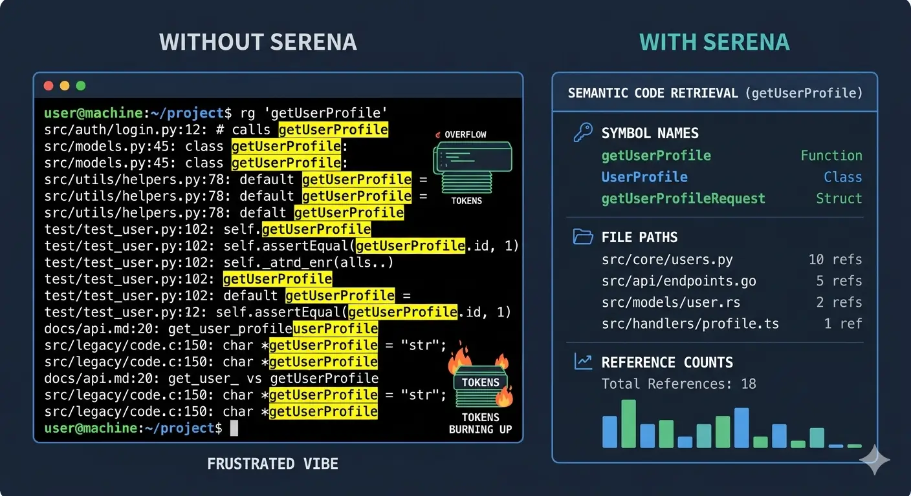
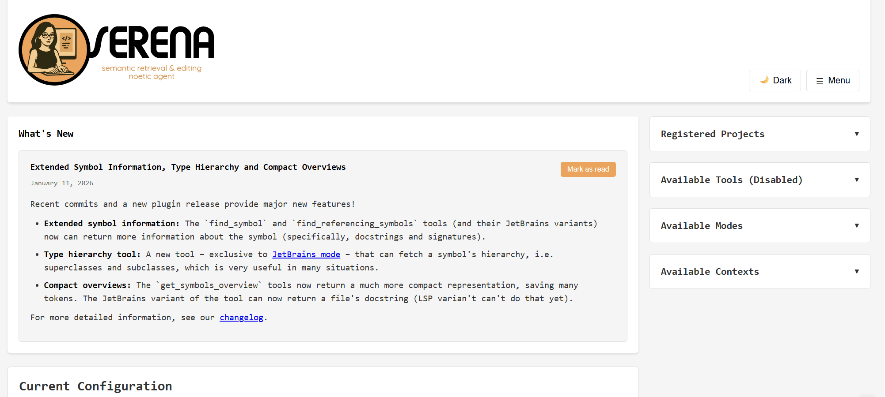

I've been recommending Serena to everyone at work for a while, yet somehow never got around to trying it myself. I finally sat down with it on a hobby project - a TypeScript monorepo - and the results were good enough that I wanted to write it up. In short: it makes AI coding tools significantly smarter about your codebase, and it burns noticeably fewer tokens doing it.

## What is Serena MCP?

[Serena](https://github.com/oraios/serena) is an open-source **MCP (Model Context Protocol) server** that gives AI coding assistants IDE-level understanding of your code. Instead of treating your codebase as a pile of text files to grep through, Serena integrates with a **Language Server Protocol (LSP)** backend - the same technology that powers Go-to-Definition, Find All References, and safe renames in your editor. It exposes those capabilities as tools that any MCP-compatible client can call.

It runs locally on your machine, supports 30+ programming languages, and works with Claude Code, VS Code, Cursor, OpenCode, Claude Desktop, and more.


## The Problem: How AI Tools Navigate Code Today

When you ask an AI assistant something like "find all functions that handle authentication," here's what typically happens:

1. It runs a text search (`grep`/`ripgrep`) for the word "authentication"
2. It reads matching files, possibly in full, dumping thousands of lines of context
3. It returns every line containing that string - including comments, strings, and unrelated matches

This works fine for small projects, but falls apart fast as codebases grow. Consider four scenarios that come up constantly:

| Task | Without Serena | With Serena |
|------|---------------|-------------|
| **Semantic search** - "find auth functions" | Text match on "auth" - returns false positives, misses functions named `verifyCredentials` | Returns `authenticateUser()`, `login()`, `verifyCredentials()` with file locations and line numbers |
| **Go to definition** - "show me the User schema" | Searches files for "User" and "schema" - returns every reference | Jumps directly to the `User` class/interface definition with full import tree |
| **Find references** - "where is PaymentProcessor used?" | Text search for "PaymentProcessor" - misses dynamic usages | Returns all usages with context: imports, instantiations, method calls |
| **Cross-file refactoring** - "rename UserService to AccountService" | Text search and replace - misses string interpolations or aliased imports, breaks things | Semantic rename via LSP - updates every reference correctly across the entire codebase |

The token cost compounds everything. Without semantic tools, the AI has to read full files to understand structure, then pass that content back in context. With Serena, it calls `find_symbol("UserService")` and gets precisely what it needs.

## How Serena Changes the Game

Serena operates at the **symbol level**. It indexes your project through a real language server, building a relational map of your code - which functions call which, where types are defined, what imports what. When an AI tool needs to understand or modify your code, it uses Serena's tools instead of raw file reads and writes:

- **`find_symbol`** - Locate any symbol by name, optionally reading its full body
- **`get_symbols_overview`** - Get a high-level map of all symbols in a file or directory, without reading the full source
- **`find_referencing_symbols`** - Find every call site and usage of a symbol across the codebase
- **`rename_symbol`** - Safe rename via the LSP - every reference updated, nothing missed
- **`replace_symbol_body`** - Surgically replace a function or class body without touching the surrounding code
- **`insert_before_symbol` / `insert_after_symbol`** - Add code at a precise semantic position

Instead of the LLM editing files line-by-line (and potentially losing track of a reference somewhere), it delegates the edit to Serena. Since Serena works off its indexed data and the language server, edits are reference-aware - if something is used in 20 places, all 20 get updated.

You can find all of the language server tools' list [here](https://oraios.github.io/serena/01-about/035_tools.html).



### The Memory System

Serena also maintains a **persistent memory store** per project. As the AI assistant discovers things about your codebase - conventions, gotchas, architecture decisions - it can write those to memory. Those notes survive conversation resets and are available in future sessions, so you don't start from scratch every time.

## The Admin Dashboard

Serena ships with a **web-based admin dashboard** at `http://localhost:24282/dashboard/index.html` (enabled by default). It gives you a live view into what Serena is doing:

- Session overview and active projects
- Tool call log with statistics (which tools were called, how often, how long they took)
- Live server logs
- Config file editor - you can tweak settings without restarting
- Memory manager - view and edit the project memories Serena has accumulated
- Server controls

On macOS and Windows, Serena also provides a native wrapper that lives in your system tray. On Linux, it's browser-only.



## Contexts: Picking the Right Mode for Your Client

Serena ships with several pre-defined **contexts** that control which tools are exposed to the AI. The idea is that your AI client may already handle certain things natively - file reading, shell execution - so Serena avoids duplicating them to keep the tool list clean.

| Context | Designed for | What it does |
|---------|-------------|--------------|
| `desktop-app` | Claude Desktop, general use | **Full toolset** - everything Serena offers. Use this when the client has no built-in coding capabilities. This is also the right choice for a shared Docker instance serving multiple different clients. |
| `claude-code` | Claude Code | Disables tools that overlap with Claude Code's built-in capabilities (file edits, shell commands, etc.) to avoid conflicts. Single-project context. |
| `ide` | VS Code, Cursor, Cline | Generic IDE augmentation - focuses on semantic tools, assumes the IDE already handles basic file operations. Single-project context. |
| `agent` | Agno, autonomous agents | Broader autonomy for agents that drive the full workflow independently. |
| `codex` | OpenAI Codex | Optimized for Codex's tool calling format. |
The `claude-code` and `ide` contexts are **single-project**: when you pass a project path at startup, those contexts lock down to only the tools relevant to that project and disable the project-switching tool entirely (since you won't need it).

If you're running Serena in Docker and want to serve Claude Code, VS Code, *and* OpenCode from the same container, use `desktop-app` - it's the superset. If you're running Serena locally, per-client, use the context that matches your tool.

## Installation

### Standard Installation

First, install Serena via [uv](https://github.com/astral-sh/uv) (the Serena docs explicitly warn against installing through MCP marketplaces - they ship outdated commands):

```bash
uv tool install -p 3.13 serena-agent@latest --prerelease=allow
serena init
```

This installs the `serena` CLI globally and runs the initialization wizard. After that, configure your clients:

**Claude Code - global configuration (recommended):**

```bash
claude mcp add --scope user serena -- serena start-mcp-server \
  --context claude-code --project-from-cwd
```

**VS Code (`.vscode/mcp.json` in your project root):**

```json
{
  "servers": {
    "serena": {
      "type": "stdio",
      "command": "serena",
      "args": [
        "start-mcp-server",
        "--context", "ide",
        "--project", "${workspaceFolder}"
      ]
    }
  }
}
```

**Claude Desktop (`~/.config/claude_desktop_config.json` on Linux, `~/Library/Application Support/Claude/claude_desktop_config.json` on macOS):**

```json
{
  "mcpServers": {
    "serena": {
      "command": "serena",
      "args": ["start-mcp-server", "--context", "desktop-app"]
    }
  }
}
```

### Docker Installation

The Docker approach is what I use, and it's what the Serena docs recommend for isolation - especially when you're letting an AI agent make edits. Running Serena in a container means it only has access to the specific directories you mount.

Add this to your `compose.yml`:

```yaml
services:
  serena:
    image: ghcr.io/oraios/serena:latest
    container_name: myproject-serena
    restart: unless-stopped
    environment:
      - SERENA_DOCKER=1
    ports:
      - "10121:9121"   # SSE endpoint
      - "34282:24282"  # Web dashboard
    volumes:
      - .:/workspace/myproject
    command: >
      serena start-mcp-server
        --transport sse
        --port 9121
        --host 0.0.0.0
        --context desktop-app
        --project /workspace/myproject
```

A few things worth noting:

- **`--transport sse`** is required for Docker - the `stdio` transport only works when Serena is a direct subprocess of the client.
- **`--context desktop-app`** gives you the broadest tool set. This works with all clients (Claude Code, VS Code extensions, OpenCode). Narrower contexts like `claude-code` disable tools other clients need.
- **`--project /workspace/myproject`** must point to the container-internal path where you mounted your code. Don't use `--project-from-cwd` in Docker - the container's working directory is Serena's own install location, not your project.
- I use non-standard host ports (`10121` and `34282`) so multiple projects can run their own Serena instances without stepping on each other.

When `SERENA_DOCKER=1` is set, Serena knows it's running in a container. You'll also want to make sure your global `~/.serena/serena_config.yml` (mounted into the container or baked into your setup) has these Docker-appropriate settings:

```yaml
gui_log_window: false
web_dashboard_listen_address: "0.0.0.0"
web_dashboard_open_on_launch: false
```

To mount your host config into the container, add a volume entry: `~/.serena:/root/.serena`.

Start it with:

```bash
docker compose up -d serena
```

## Connecting Your AI Tools

### Claude Code

Register Serena once as a global MCP server:

```bash
claude mcp add serena --transport sse --url http://localhost:10121/sse
```

Or check it into your project as `.mcp.json`:

```json
{
  "mcpServers": {
    "serena": {
      "type": "sse",
      "url": "http://localhost:10121/sse"
    }
  }
}
```

### VS Code / Cursor / Windsurf

Add `.vscode/mcp.json` to your project root:

```json
{
  "servers": {
    "serena": {
      "type": "sse",
      "url": "http://localhost:10121/sse"
    }
  }
}
```

### OpenCode

Add this to `opencode.jsonc`:

```jsonc
{
  "mcp": {
    "serena": {
      "type": "remote",
      "url": "http://localhost:10121/sse",
      "enabled": true
    }
  }
}
```

Serena also works with Codex, Kilo Code, and any other MCP-compatible client. The connection is always the same SSE endpoint - it's just the config file format that differs per tool.

## Project Configuration

Serena looks for a `.serena/project.yml` in your project root. Here's a minimal but practical config for a TypeScript project:

```yaml
project_name: "myproject"

languages:
  - typescript   # uses typescript-language-server

encoding: "utf-8"
ignore_all_files_in_gitignore: true

ignored_paths:
  - "node_modules"
  - "dist"
  - "build"
  - "coverage"
  - ".next"
  - "out"
  - ".cache"
```

The `ignored_paths` list is a belt-and-suspenders measure alongside `.gitignore`. Without it, `node_modules` alone can contain 80,000+ files - indexing them makes startup painfully slow and pollutes symbol search with third-party internals.

**What to commit vs gitignore:**

```
.serena/project.yml      ← commit this (shared config)
.serena/memories/        ← commit this (AI-generated project notes, useful for everyone)
.serena/cache/           ← gitignore (rebuilt per machine)
.serena/project.local.yml ← gitignore (per-developer overrides)
```

## My Experience

I integrated Serena into [BrewForm](https://github.com/Ardakilic/BrewForm), a Deno 2 + TypeScript monorepo with a frontend, API, and shared packages. What stood out:

**Cross-package symbol resolution.** Because the entire monorepo is mounted as a single workspace, Serena can trace a type from `packages/` through its usages in `apps/api/` in one shot. Previously the AI would read through files one at a time trying to stitch it together.

**Safer refactors.** When I had a task that touched 20-odd files - renaming a shared interface - the AI delegated the actual edits to Serena's `rename_symbol`. No file was missed. Contrast that with text search-and-replace, where there's always that one dynamic usage hiding in a template string.

**Natural language questions.** I asked things like "explain the auth flow in this codebase" and instead of the AI wandering through files, Serena returned the relevant symbols with context. It was faster, more accurate, and the response took less context space.

**Token savings.** This is harder to measure precisely, but it's real. The AI isn't reading full files to find a function definition - it calls `find_symbol` and gets the body directly. Edit information doesn't bloat the context either, since Serena handles the writes.

The Makefile commands I set up also help make it a habit:

```bash
make serena-up      # Start the Serena container
make serena-stop    # Stop it
make serena-logs    # Tail logs
make serena-index   # Force re-index after big changes
make serena-health  # Health check the workspace
```

## Final Thoughts

Serena fills a real gap. AI coding tools are good at reasoning and generating code - they're not inherently good at navigating large codebases efficiently. Plugging in a language server that's specifically built for that job makes a meaningful difference, both in output quality and cost.

If you're spending a lot of context on file reads and getting imprecise refactors across large projects, Serena is absolutely worth an afternoon to set up. The Docker path in particular is clean - it runs alongside your stack, persists its index, and every client in your team can point at the same SSE endpoint.

The project is on GitHub at [oraios/serena](https://github.com/oraios/serena) and is actively maintained. Give it a try.

---

## Further Reading

- [Serena on GitHub](https://github.com/oraios/serena)
- [Official Serena Documentation](https://oraios.github.io/serena/01-about/000_intro.html)
- [Model Context Protocol (MCP) Introduction](https://modelcontextprotocol.io/introduction)
- [Serena Docker Setup Guide](https://github.com/oraios/serena/blob/main/DOCKER.md)
- [My Docker Implementation that I use in Claude Code and OpenCode](https://github.com/Ardakilic/BrewForm/commit/41006738ff9e6ea82bebd3ef21de5bac1d04edef)